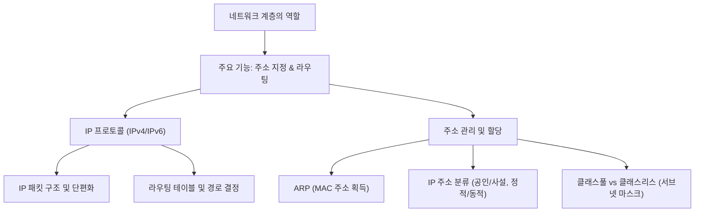
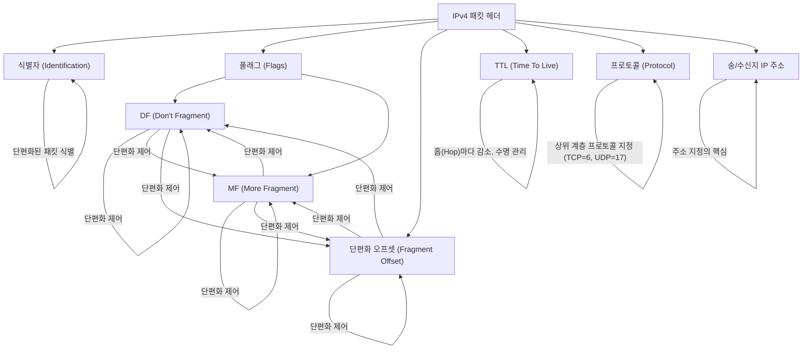

  

## 1. 개요

  

## 1.1 서론

네트워크 통신에서 **네트워크 계층**은 서로 다른 네트워크 간의 통신을 가능하게 하는 핵심적인 역할을 수행합니다. 이전 계층인 물리 계층과 데이터 링크 계층이 주로 같은 네트워크(LAN) 내 통신에 한정되었다면, 네트워크 계층은 이 한계를 넘어 전 세계적인 통신을 가능하게 합니다. 이 노트에서는 네트워크 계층의 주요 기능인 **주소 지정(IP 주소)**과 **라우팅(최적 경로 결정)**을 중심으로, IP 프로토콜의 세부 사항, 주소 관리 방식(클래스풀/클래스리스), 그리고 주소 할당 방식(ARP, DHCP)까지 종합적으로 다룹니다. ==이러한 개념들을 이해하는 것은 현대 네트워크 통신의 근간을 파악하는 데 필수적입니다.==

  

## 1.2 전체 구조

  

## 2. 네트워크 계층의 기능과 존재 이유

  

## 2.1 네트워크 계층의 역할과 제공 기능

네트워크 계층(3계층)은 물리 계층과 데이터 링크 계층이 다루는 **LAN(Local Area Network)을 넘어서 다른 네트워크와의 통신**을 위해 존재합니다. ==이 계층은 두 가지 핵심 기능을 제공하여 이종 네트워크 간의 연결을 가능하게 합니다.==

  

- **주소 체계를 통한 대상 지정:**
    
    - **IP 주소**라는 주소 체계를 사용하여 송신지의 대상을 명확하게 지정합니다.   
        
    - IP 주소는 논리 주소로 불리며, 호스트에게 유동적으로 할당될 수 있습니다.   
        
    
- **라우팅을 통한 최적 경로 결정:**
    
    - **라우팅**은 패킷이 이동할 최적의 경로를 결정하는 과정입니다.   
        
    - 이 과정은 **라우터**라는 네트워크 계층 장비를 통해 수행됩니다.   
        
    - 패킷이 여러 네트워크 장비(라우터)를 거쳐 이동하는 것을 **홉(Hop)**이라고 하며, TTL 필드는 이 홉마다 1씩 감소하여 패킷의 수명을 관리합니다.   
        
    

  

## 2.2 물리/데이터 링크 계층의 한계

네트워크 계층이 필요한 이유는 이전 계층만으로는 다른 네트워크까지의 통신이 어렵기 때문입니다. 이 한계는 크게 두 가지로 요약됩니다.   

  

- **경로 파악의 어려움:** 물리/데이터 링크 계층 기술만으로는 패킷이 지구 반대편 등 다른 네트워크까지 도달할 최적의 경로를 판단하기 어렵습니다.   
    
- **MAC 주소의 한계:** MAC 주소는 네트워크 인터페이스에 할당되는 물리 주소이지만, 호스트가 속한 네트워크가 시시때때로 변할 수 있어 ==전 세계 모든 호스트의 위치를 MAC 주소만으로 특정하기 어렵습니다.==   
    

  

## 2.3 IP 주소와 MAC 주소의 역할 비교 (택배 비유)

MAC 주소의 한계를 극복하기 위해 IP 주소가 사용되며, 이 둘은 택배 배송에 비유하여 이해할 수 있습니다.   

  

|   |   |   |   |
|---|---|---|---|
|**구분**|**역할 (택배 비유)**|**주소 유형**|**특징**|
|**IP 주소**|수신지 (어디에 있는가)|논리 주소|라우팅 시 우선적으로 사용되며 유동적 할당 가능.|
|**MAC 주소**|수신인 (누구에게 가는가)|물리 주소|최종 호스트 식별에 사용되며 NIC에 고정 할당됨.|

  

- 네트워크 패킷은 IP 주소와 MAC 주소를 모두 명시하지만, **라우팅 시에는 IP 주소를 기반으로 이루어지고**, MAC 주소는 최종 호스트 식별에 사용됩니다.   
    

  

## 3. IP 프로토콜의 주요 기능과 구조

  

## 3.1 IP 프로토콜의 공식 기능 (RFC 791 기반)

IP(Internet Protocol)는 네트워크 계층의 가장 중요한 프로토콜로, 물리/데이터 링크 계층의 한계를 극복하며 두 가지 핵심 기능을 제공합니다.   

  

- **주소 지정 (Addressing):** IP 주소를 활용하여 특정 네트워크에 속한 특정 호스트를 지칭합니다.   
    
- **단편화 (Fragmentation):** 전송하려는 패킷 크기가 MTU(Maximum Transmission Unit)보다 클 경우, 패킷을 여러 개로 쪼개어 보내는 기능입니다.   
    

  

> **참고:** IP 프로토콜의 공식 정의는 인터넷 표준 문서인 **RFC 791**에 명시되어 있습니다.   

  

## 3.2 IP 버전 4 (IPv4) 패킷 헤더 필드

IPv4는 총 32비트로 표현되며, 4개의 옥텟(0~255)이 점으로 구분됩니다. 단편화와 주소 지정을 위해 다음과 같은 핵심 필드들이 사용됩니다.

  

  

- **식별자 (Identifier):** 단편화된 여러 패킷들이 동일한 데이터에서 왔음을 식별하는 고유 번호입니다.   
    
- **플래그 (Flags):** 3비트로 구성되며, **DF(Don't Fragment)**는 단편화를 금지하며, **MF(More Fragment)**는 뒤에 더 많은 단편 패킷이 있음을 나타냅니다.   
    
- **단편화 오프셋 (Fragment Offset):** 쪼개진 패킷들이 원래 데이터에서 얼마나 떨어져 있는지(순서)를 나타내어 수신지에서 재조합할 때 사용됩니다.   
    
- **TTL (Time To Live):** 패킷의 수명으로, 라우터를 한 번 거칠 때마다(1홉당) 1씩 감소하며 0이 되면 폐기됩니다.   
    
- **프로토콜 필드:** 상위 계층(전송 계층 등)에서 어떤 프로토콜이 캡슐화되었는지 나타냅니다.   
    
- **송/수신지 IP 주소:** 주소 지정 기능에 직접 관여하는 필드로, 32비트로 표현됩니다.   
    

  

## 3.3 IP 버전 6 (IPv6)의 특징

IPv6는 IPv4의 주소 고갈 문제를 해결하기 위해 등장했으며, 주소 공간이 훨씬 넓습니다.   

  

- **주소 표현:** 128비트 기반이며, 콜론으로 구분된 8개의 그룹으로 16진수를 사용하여 표기합니다.   
    
- **주소 개수:** 21282128$2^{128}$개로, 사실상 무한에 가까운 주소 할당이 가능합니다.   
    
- **헤더 구조:** IPv4에 비해 간소화되었으며, **확장 헤더(Extension Header)**를 가질 수 있는 것이 특징입니다.   
    
- **단편화:** IPv6에서는 단편화가 **단편화 확장 헤더**를 통해 이루어지며, 이 헤더에는 오프셋, M 플래그(MF와 유사), 식별자 등이 포함됩니다.   
    

  

## 3.4 IP 단편화의 부작용과 회피 전략

IP 단편화는 불필요한 트래픽 증가와 대역폭 낭비를 유발하며, 수신 측에 재조립 부하를 주어 성능 저하를 일으킬 수 있으므로 **최대한 피하는 것이 좋습니다.**   

  

- **경로 MTU (Path MTU):** IP 단편화 없이 주고받을 수 있는 최대 크기를 의미하며, 이는 패킷이 거치는 모든 노드(라우터 포함)가 처리 가능한 가장 작은 MTU 크기에 의해 결정됩니다.   
    
- **경로 MTU 발견 (Path MTU Discovery):** 경로 MTU를 발견하여 그 크기만큼만 데이터를 송수신함으로써 단편화를 회피하는 기법입니다.   
    
- **현대의 경향:** 오늘날 대부분의 IPv4 패킷은 **DF(Don't Fragment) 플래그가 설정**되어 있어 단편화가 잘 발생하지 않습니다.   
    

  

## 4. IP 주소의 구조와 관리 방식

  

## 4.1 IP 주소의 구성 요소 (네트워크 주소 vs 호스트 주소)

IP 주소(IPv4 기준 32비트)는 주소 지정을 위해 두 부분으로 구성됩니다.   

  

- **네트워크 주소 (Network ID):** 특정 네트워크 자체를 식별하는 부분입니다.   
    
- **호스트 주소 (Host ID):** 특정 네트워크 내의 특정 호스트를 식별하는 부분입니다.   
    

  

네트워크 주소와 호스트 주소에 할당되는 비트 수는 고정되어 있지 않고 네트워크 크기에 따라 달라집니다.   

  

- 호스트 주소 비트 수가 클수록 한 네트워크에 할당 가능한 호스트 수가 많아지지만, 사용하지 않는 주소가 낭비될 수 있습니다.   
    
- 호스트 주소 비트 수가 작으면 할당 가능한 호스트 수가 적어지지만, 주소 낭비를 줄일 수 있습니다.   
    

  

## 4.2 클래스풀 주소 체계 (Classful Addressing)

IP 주소의 네트워크 크기 할당 고민을 해결하기 위해 등장한 것이 **클래스** 개념입니다. A, B, C 클래스가 실질적으로 사용되며, 네트워크 주소로 사용되는 옥텟(Octet) 수가 다릅니다.

  

|   |   |   |   |   |
|---|---|---|---|---|
|**클래스**|**네트워크 주소 크기**|**호스트 주소 크기**|**할당 가능 호스트 수 (이론적)**|**첫 번째 옥텟 범위**|
|A|1옥텟 (8비트)|3옥텟 (24비트)|224224$2^{24}$개 (≈1600≈1600$\approx 1600$만 개)|0 ~ 127|
|B|2옥텟 (16비트)|2옥텟 (16비트)|216216$2^{16}$개 (≈6≈6$\approx 6$만 5천 개)|128 ~ 191|
|C|3옥텟 (24비트)|1옥텟 (8비트)|2828$2^8$개 (≈254≈254$\approx 254$개)|192 ~ 223|

  

  

- **예약된 주소:** 호스트 주소가 전부 0인 주소는 **네트워크 주소**로, 전부 1인 주소는 **브로드캐스트 주소**로 사용되어 개별 호스트 할당이 불가능합니다.   
    

  

## 4.3 클래스리스 주소 체계와 서브넷 마스크

클래스풀 방식은 네트워크 크기가 고정되어 있어 주소 낭비가 심하고 정교한 크기 구성이 어렵다는 한계가 있습니다. 이를 해결하기 위해 **클래스리스 주소 체계(CIDR)**가 사용됩니다.

  

- **클래스리스의 특징:** 클래스 개념에 구애받지 않고 네트워크 영역을 나누며, 더 유동적이고 정교한 네트워크 구성을 가능하게 합니다.   
    
- **서브넷 마스크:** 클래스 개념 없이 IP 주소에서 네트워크 주소 부분과 호스트 주소 부분을 구분하는 수단입니다. 1은 네트워크 주소, 0은 호스트 주소를 의미하는 비트 열입니다.   
    
- **네트워크 주소 계산:** IP 주소와 서브넷 마스크를 **비트 AND 연산**하면 해당 네트워크의 네트워크 주소를 얻을 수 있습니다.   
    
- **CIDR 표기법:** 서브넷 마스크의 1의 개수를 IP 주소 뒤에 `/숫자` 형태로 표기하는 방식입니다 (예: `/24`).   
    
- **서브네팅:** 서브넷 마스크를 이용하여 클래스 기반의 네트워크를 더 잘게 나누어 사용하는 것을 의미합니다.   
    

  

## 4.4 IP 주소의 분류 (공인/사설, 정적/동적)

IP 주소는 사용 범위와 할당 방식에 따라 추가로 분류됩니다.   

  

|   |   |   |
|---|---|---|
|**분류 기준**|**구분**|**특징**|
|**사용 범위**|**공인 IP 주소 (Public)**|전 세계에서 유일하며 인터넷 통신에 사용됨. 공식 기관이나 ISP가 할당.|
||**사설 IP 주소 (Private)**|사설 네트워크 내에서만 유효하며 중복 가능. 라우터/공유기가 할당.|
|**할당 방식**|**정적 IP 주소 (Static)**|호스트에서 수작업으로 직접 입력하여 할당. IP, 서브넷 마스크, 게이트웨이, DNS 주소 필요.|
||**동적 IP 주소 (Dynamic)**|**DHCP** 프로토콜을 기반으로 자동으로 할당되며, 사용 기간(임대 기간)이 정해져 있음.|

  

- **NAT (Network Address Translation):** 사설 IP 주소를 사용하는 내부 호스트가 인터넷 통신을 위해 공인 IP 주소로 변환하는 기술입니다.   
    
- **DHCP 과정:** 클라이언트가 DHCP 서버에 IP 주소를 요청할 때 **DHCP Discover (브로드캐스트)** → **DHCP Offer** → **DHCP Request** → **DHCP ACK**의 4단계 메시지를 주고받습니다.   
    

  

## 4.5 특수 예약 IP 주소

특별한 목적으로 예약된 IP 주소들이 있으며, 개발 및 라우팅에 유용하게 사용됩니다.   

  

- **127.0.0.1 (루프백 주소):** 자기 자신을 가리키는 주소로, 부메랑처럼 패킷이 자신에게 되돌아옵니다. 주로 테스트나 디버깅 용도로 사용됩니다.   
    
- **0.0.0.0:**
    
    - IP 주소를 할당받기 전(예: DHCP Discover 시)에 자신을 지칭할 수단이 없을 때 임시로 사용됩니다.   
        
    - 라우팅에서는 서브넷 마스크 0과 함께 **디폴트 라우트(Default Route)**를 지칭하는 데 사용되며, 이는 라우터가 목적지를 결정하기 어려울 때 패킷을 내보낼 기본 경로를 의미합니다.   
        
    

  

## 5. 라우팅 테이블과 경로 결정

  

## 5.1 라우팅의 이해와 경로 확인

라우팅은 패킷이 이동할 최적의 경로를 결정하는 과정이며, **홉 바이 홉(Hop by Hop) 라우팅** 방식으로 여러 라우터를 거쳐 이동합니다.   

  

- **경로 추적:**
    
    - Windows에서는 `tracert [수신지]` 명령어를 사용합니다.   
        
    - Linux/macOS에서는 `traceroute [수신지]` 명령어를 사용합니다.   
        
    

  

## 5.2 라우팅 테이블의 구조와 역할

라우터는 **라우팅 테이블**이라는 표 형태의 정보를 참고하여 패킷을 어디로 내보낼지 결정합니다. 이 테이블은 수동으로 만들 수도 있고, **라우팅 프로토콜**을 통해 자동으로 생성될 수도 있습니다.   

  

라우팅 테이블의 핵심 구성 요소는 다음과 같습니다.

  

- **수신지 IP 주소와 서브넷 마스크:** 패킷의 최종 목적지를 나타냅니다.   
    
- **다음 홉 (Next Hop) / 게이트웨이:** 최종 목적지까지 가기 위해 **다음에 거쳐야 할 노드(라우터)의 IP 주소**입니다.   
    
- **네트워크 인터페이스:** 패킷을 내보낼 통로(인터페이스 이름 또는 IP 주소)를 명시합니다.   
    
- **매트릭 (Metric):** 해당 경로로 이동하는 데 드는 **비용(Cost)**을 의미하며, 값이 낮을수록 우선순위가 높습니다.   
    

  

## 5.3 디폴트 라우트의 중요성

라우팅 테이블에서 가장 중요한 정보 중 하나는 **디폴트 라우트**입니다.   

  

- **정의:** 수신지 IP 주소와 서브넷 마스크가 라우팅 테이블의 다른 어떤 항목과도 일치하지 않을 때 사용되는 경로입니다.   
    
- **표기:** 수신지 IP 주소 0.0.0.0, 서브넷 마스크 /0으로 표기됩니다.   
    
- **실제 역할:** 대부분의 경우 디폴트 라우트의 게이트웨이 주소는 **기본 게이트웨이(공유기/외부로 나가는 첫 번째 라우터 주소)**가 됩니다.   
    

  

## 5.4 라우팅 테이블 확인 명령어

사용자의 컴퓨터 환경에서 라우팅 테이블을 직접 확인할 수 있습니다.   

  

- **Windows:** `cmd`에서 `route print` 명령어를 사용합니다. (네트워크 대상, 네트워크 마스크, 게이트웨이, 인터페이스, 매트릭 정보 확인)   
    
- **macOS/Linux:** `netstat -rn` 명령어를 사용합니다.