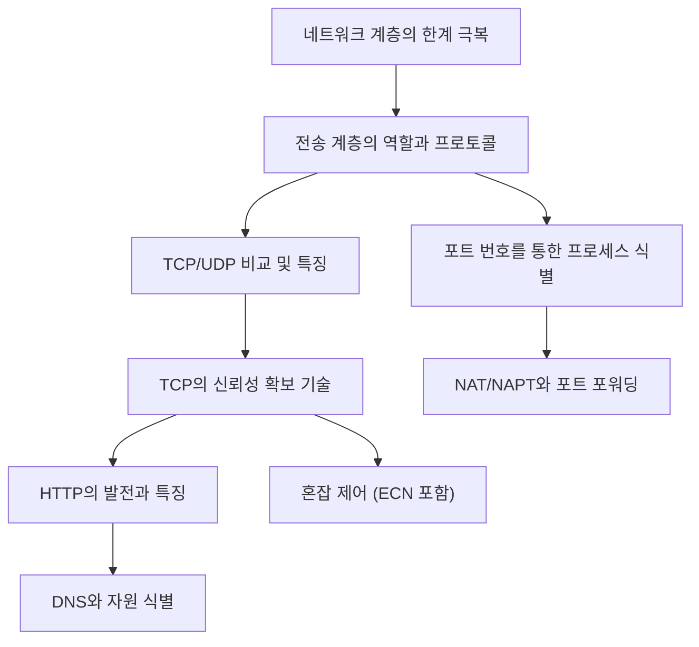

  

## 1. 개요

  

## 1.1 서론

우리가 매일 사용하는 인터넷 통신은 여러 계층으로 나뉘어 복잡하게 이루어지고 있습니다. 이 노트는 네트워크의 핵심인 **전송 계층**과 **응용 계층**에서 사용되는 주요 프로토콜과 기술들을 종합적으로 정리합니다. 특히, 네트워크 계층의 한계를 극복하는 방법, 데이터 전송의 신뢰성을 확보하는 메커니즘, 그리고 웹 통신의 기반이 되는 HTTP의 발전 과정까지 깊이 있게 다룹니다. 이 내용을 통해 네트워크 통신의 흐름과 핵심 원리를 ==누락 없이 꼼꼼하게 이해==하실 수 있을 거예요.

  

## 1.2 전체 구조

  

## 2. 전송 계층: IP의 한계를 극복하는 통로

전송 계층은 네트워크 계층(IP)과 응용 계층 사이에 위치하며, IP 프로토콜이 가진 한계를 보완하고 응용 프로그램 프로세스를 식별하는 중요한 역할을 수행합니다.   

  

## 2.1 IP 프로토콜의 한계와 전송 계층의 역할

IP 프로토콜은 기본적으로 **신뢰할 수 없는 통신**과 **비연결형 통신**이라는 두 가지 주요 특성을 가집니다. 전송 계층은 이러한 IP의 한계를 극복하기 위해 신뢰성 있는 통신과 연결 통신 기능을 제공합니다.   

  

- **신뢰할 수 없는 통신 (비신뢰성)**:
    
    - 패킷이 수신지까지 제대로 전송되었는지 **보장하지 않습니다**.   
        
    - 패킷의 손실, 잘못된 전송, 순서 오류 등을 확인하거나 재전송하지 않으며, 이를 **최선형 전달(Best Effort)**이라고도 부릅니다.   
        
    
- **비연결형 통신**:
    
    - 송수신 호스트 간에 데이터를 주고받기 전에 **사전 연결 수립 작업을 거치지 않습니다**.   
        
    - IP는 그저 패킷을 일방적으로 보내기만 합니다.
        
    

  

IP가 이러한 특성을 갖는 주된 이유는 **성능** 때문입니다. 신뢰성 있는 통신은 하나하나 꼼꼼히 확인해야 하므로 빠른 패킷 처리에 악영향을 줄 수 있습니다.   

  

|   |   |   |
|---|---|---|
|**IP 통신 특성**|**설명**|**전송 계층 보완**|
|비신뢰성|패킷 전송 보장 없음 (최선형 전달)|TCP를 통해 신뢰성 있는 통신 제공|
|비연결형|사전 연결 수립 작업 없음|TCP를 통해 연결 통신 기능 제공|

  

## 2.2 포트 번호를 통한 프로세스 식별

네트워크 계층의 IP 주소는 특정 **호스트(컴퓨터)**를 식별하지만, 하나의 컴퓨터에서 여러 프로그램(프로세스)이 동시에 네트워크를 사용할 때, 패킷이 최종적으로 도달해야 할 **특정 프로세스**를 구분해야 합니다.   

  

- **포트(Port)**: 네트워크상에서 특정 컴퓨터가 실행 중인 **특정 애플리케이션 프로세스를 식별하는 정보**입니다.   
    
- **포트 번호**: TCP/UDP 패킷 헤더에 송신지 포트와 수신지 포트가 16비트로 명시되며, 총 216=65,536216=65,536$2^{16} = 65,536$개의 포트 번호(0번부터 65,535번)를 사용할 수 있습니다.   
    
- **IP 주소와 포트 번호의 조합**: 특정 호스트와 그 호스트에서 실행 중인 특정 애플리케이션 프로세스를 식별하는 데 사용됩니다 (예: `IP 주소:포트 번호`).   
    

  

## 포트 번호의 유형 분류

포트 번호는 범위에 따라 세 가지 유형으로 분류되며, 주로 영어 용어로 지칭됩니다.   

  

|   |   |   |
|---|---|---|
|**유형**|**범위**|**특징**|
|**웰노운 포트 (Well-known Port)**|0 ~ 1023|시스템 포트라고도 불리며, **범용적인** 애플리케이션 프로토콜(DNS, HTTP 등)이 사용하는 잘 알려진 포트입니다.|
|**등록된 포트 (Registered Port)**|1024 ~ 49151|웰노운 포트보다 덜 범용적이며, 비교적 큰 기업 제품이나 유명 오픈소스에 할당되는 경우가 많습니다 (예: MySQL 3306, MS SQL 1433).|
|**동적 포트 (Dynamic Port)**|49152 ~ 65535|사설 포트 또는 임시 포트라고도 불리며, **특별히 관리되지 않아 자유롭게 사용** 가능합니다. 클라이언트 프로그램(예: 웹 브라우저)이 통신 시 임시로 할당받아 사용합니다.|

  

- **IANA**: 웰노운 포트와 등록된 포트는 **인터넷 할당 번호 관리 기관(IANA)**에서 할당 및 관리합니다.   
    
- **권고 사항**: 포트 번호 할당은 강제 사항이 아닌 **권고 사항**일 뿐입니다.   
    

  

## 2.3 NAT와 포트 기반 NAT (NAPT/PAT)

NAT(Network Address Translation)는 IP 변환 기술로, 사설 IP 주소를 공인 IP 주소로 변환해 줍니다.   

  

- **기존 NAT의 한계**: IP 주소 1대1 대응 방식에서는 사설 IP 주소 개수만큼 공인 IP 주소가 필요하여 **공인 IP 주소 낭비** 문제가 발생했습니다.   
    
- **포트 기반 NAT (NAPT 또는 PAT)**: 이 한계를 **포트 번호**를 이용해 극복합니다. NAT 변환 테이블에 IP 주소 쌍과 **포트 번호**를 함께 기록하고 변환합니다.   
    
    - 이를 통해 여러 사설 IP 주소가 **하나의 공인 IP 주소를 공유**할 수 있게 되어 공인 IP 주소 부족 문제를 개선했습니다.   
        
    

  

## 2.4 포트 포워딩

포트 포워딩은 네트워크 외부 호스트가 내부 특정 호스트로 연결을 시도할 때 사용되는 기술입니다.   

  

- **기능**: 공유기의 공인 IP 주소와 특정 **서비스 포트 번호 쌍**을 네트워크 내부의 특정 호스트의 IP 주소와 **내부 포트 번호 쌍**에 미리 할당하여, 외부에서 해당 쌍으로 패킷을 보내면 자동으로 내부 특정 호스트에게 전달해 주는 기능입니다.   
    
- **설정**: 공유기 설정에서 서비스 포트, 프로토콜, 내부 IP 주소, 내부 포트를 지정하여 설정할 수 있습니다.   
    

  

## 2.5 ICMP (Internet Control Message Protocol)

ICMP는 IP 프로토콜의 **비신뢰성**과 **비연결형** 특성을 보완하는 **보조 도구**입니다.   

  

- **역할**: IP 패킷의 전송 과정에 대한 **피드백 메시지**를 제공하여 오류를 보고하거나 네트워크 진단 정보를 제공합니다.   
    
- **메시지 구성**: ICMP 메시지는 **타입(유형)**과 **코드(구체적 내용)**의 조합으로 이루어집니다.   
    
- **주요 타입/코드 예시**:
    
    - **타입 3 (수신지 도달 불가)**: 코드 0번(네트워크 도달 불가), 1번(호스트 도달 불가), 3번(포트 도달 불가) 등이 있습니다.   
        
    - **타입 11 (시간 초과)**: TTL 만료 시 발생합니다.   
        
    - **에코 요청/응답**: 대표적으로 **핑(ping)** 명령어에서 사용됩니다.   
        
    
- **중요**: ICMP는 IP의 신뢰성을 **완전히 보장하지 않으며**, IP 한계를 원천적으로 극복하려면 전송 계층의 **TCP**를 이용해야 합니다.   
    

  

## 3. TCP와 UDP: 신뢰성과 속도의 선택

전송 계층의 대표적인 두 프로토콜인 TCP와 UDP는 IP의 한계를 보완하는 방식에서 명확히 구분됩니다.   

  

## 3.1 TCP (Transmission Control Protocol)

TCP는 **신뢰할 수 있는 연결형 통신**을 제공하는 프로토콜입니다.   

  

- **연결 지향**: 송수신 호스트 간에 **연결 수립(3-Way Handshake)** 후 데이터를 송수신하고, 종료 시 **연결 종료** 과정을 거칩니다.   
    
- **신뢰성 기능**: 재전송을 통한 **오류 제어**, **흐름 제어**, **혼잡 제어** 등을 제공합니다.   
    
- **상태 유지 (Stateful)**: 통신 상태 정보를 유지하고 활용하는 **스테이트풀 프로토콜**입니다.   
    

  

## TCP 세그먼트의 주요 필드

TCP 통신 단위를 **세그먼트**라고 부르며, 헤더에는 신뢰성 확보를 위한 중요한 필드들이 포함됩니다.   

  

|   |   |
|---|---|
|**필드**|**역할**|
|**송/수신지 포트**|프로세스 식별|
|**순서 번호 (Sequence Number)**|세그먼트 데이터의 **첫 번째 바이트**에 부여되며, 올바른 순서 보장을 위해 사용됩니다.|
|**확인 응답 번호 (ACK Number)**|다음으로 **수신하기를 기대하는 순서 번호**를 명시합니다.|
|**제어 비트 (Flags)**|SYN (연결 수립), ACK (확인 응답 포함), FIN (연결 종료) 등의 부가 정보를 나타냅니다.|
|**윈도우 (Window)**|**수신 윈도우 크기**를 명시하여 흐름 제어에 사용됩니다.|

  

- **MSS (Maximum Segment Size)**: TCP로 전송할 수 있는 **최대 페이로드 크기**를 의미하며, TCP 헤더 크기는 제외됩니다.   
    

  

## TCP 연결 수립 및 종료

- **연결 수립 (3-Way Handshake)**:
    
    1. **SYN**: 클라이언트(A)가 B에게 연결 요청 (A의 초기 순서 번호 포함).   
        
    2. **SYN-ACK**: 서버(B)가 A에게 확인 응답 및 연결 시작 요청 (B의 초기 순서 번호 및 A의 ACK 번호 포함).   
        
    3. **ACK**: 클라이언트(A)가 B에게 최종 승인 응답.   
        
    
    - 연결을 시작하는 호스트의 동작을 **액티브 오픈**, 수락하는 호스트의 동작을 **패시브 오픈**이라고 합니다.   
        
    
- **연결 종료 (4-Way Handshake)**:
    
    - FIN 세그먼트 전송(액티브 클로즈) →→$\rightarrow$ACK 수신 →→$\rightarrow$FIN 세그먼트 재전송 →→$\rightarrow$ACK 수신 순으로 이루어지며, 액티브 클로즈 호스트는 마지막 ACK 전송 후 **TIME_WAIT** 상태에서 일정 시간 대기합니다.   
        
    

  

## TCP 주요 상태 (State)

TCP는 통신 과정에 따라 다양한 상태(State)를 가집니다.   

  

|   |   |   |
|---|---|---|
|**유형**|**주요 상태**|**설명**|
|**연결 미수립**|CLOSED, LISTEN|LISTEN은 서버가 SYN 세그먼트를 기다리는 **연결 대기 상태**입니다.|
|**연결 수립 과정**|SYN_SENT, SYN_RCVD, ESTABLISHED|ESTABLISHED는 3-Way Handshake 완료 후 **연결이 확립된 상태**입니다.|
|**연결 종료 과정**|FIN_WAIT_1, CLOSE_WAIT, FIN_WAIT_2, LAST_ACK, TIME_WAIT|FIN_WAIT_1은 FIN 전송 후 ACK를 기다리는 상태이며, TIME_WAIT은 액티브 클로즈 호스트가 마지막 ACK 전송 후 일정 시간 대기하는 상태입니다.|

  

## 3.2 UDP (User Datagram Protocol)

UDP는 TCP와 달리 **신뢰할 수 없는 비연결형 통신**을 제공하며, IP 프로토콜을 감싸는 **껍데기**와 같습니다.   

  

- **특징**: 연결 수립/해제, 오류 제어, 흐름 제어, 혼잡 제어 등의 기능을 **제공하지 않습니다**.   
    
- **장점**: 기능이 적어 **오버헤드가 적고** TCP보다 **비교적 빠릅니다**.   
    
- **활용**: 실시간 스트리밍 서비스나 인터넷 전화처럼 **실시간성**이 강조되는 상황에 주로 사용됩니다.   
    
- **상태**: 상태를 유지하지 않는 **스테이트리스 프로토콜**입니다.   
    

  

|   |   |   |
|---|---|---|
|**구분**|**TCP**|**UDP**|
|연결 방식|연결형 (Connection-oriented)|비연결형 (Connectionless)|
|신뢰성|신뢰성 보장 (재전송, 오류 제어 등)|신뢰성 보장 안 함|
|상태 유지|스테이트풀 (Stateful)|스테이트리스 (Stateless)|
|속도/오버헤드|상대적으로 느림, 오버헤드 높음|비교적 빠름, 오버헤드 낮음|

  

## 3.3 TCP의 신뢰성 확보 기술 (오류/흐름/혼잡 제어)

TCP는 재전송 기반의 **ARQ(Automatic Repeat reQuest)**를 통해 신뢰성을 확보하며, 흐름 제어와 혼잡 제어를 통해 효율적인 전송을 관리합니다.   

  

## 3.3.1 재전송 기반 오류 제어 (ARQ)

체크섬 필드만으로는 데이터 훼손 외의 오류(유실, 순서 오류)를 제어하기 어려우므로 재전송이 필요합니다.   

  

- **오류 인지**: **중복된 확인 응답(ACK)** 수신 또는 **타임아웃** 발생 시 문제가 발생했음을 인지합니다.   
    
- **ARQ 방식**:
    
    - **Stop-and-Wait ARQ**: 하나를 보내고 확인받을 때까지 다음 메시지를 보내지 않아 **단순**하지만 **네트워크 이용 효율이 낮습니다**.   
        
    - **Go-Back-N ARQ**: 여러 세그먼트를 연속(파이프라이닝)으로 전송하며, 오류 발생 지점부터 **누적 확인 응답(RTO)**을 통해 재전송합니다.   
        
    - **Selective ARQ (Selective Repeat)**: 오류가 발생한 **개별 세그먼트만** 선택적으로 재전송하며, **개별 확인 응답**을 사용합니다. 오늘날 대부분 지원됩니다.   
        
    
- **빠른 재전송 (Fast Retransmit)**: 재전송 타이머 만료 전이라도, **동일한 세그먼트에 대한 ACK를 세 번 수신**하면 즉시 해당 세그먼트를 재전송하는 기능입니다.   
    

  

## 3.3.2 흐름 제어 (Flow Control)

흐름 제어는 **수신 호스트**가 한 번에 처리할 수 있는 데이터 양(수신 윈도우 크기)을 송신 호스트에게 알려주어, **수신자가 감당할 수 있는 만큼만** 보내도록 속도를 균일하게 유지하는 기능입니다.   

  

- **슬라이딩 윈도우**: TCP는 **슬라이딩 윈도우** 기법을 사용하며, TCP 헤더의 **윈도우 필드**에 수신 윈도우 크기가 명시됩니다.   
    
- **윈도우 이동**: 데이터를 보낼 때마다 윈도우가 오른쪽으로 미끄러지듯 이동하며, 확인 응답을 받을 때마다 윈도우가 이동하여 전송 가능한 최대 양을 조절합니다.   
    

  

## 3.3.3 혼잡 제어 (Congestion Control)

혼잡 제어는 **송신 호스트**가 **네트워크 혼잡 정도**에 맞춰 전송량을 동적으로 조절하는 기능입니다.   

  

- **혼잡 감지**: 중복된 세그먼트 수신 또는 타임아웃 발생 시 네트워크 혼잡을 판단합니다.   
    
- **혼잡 윈도우 (Congestion Window, CWND)**: 혼잡 없이 안전하게 전송할 수 있는 데이터 양을 나타내며, TCP 헤더에 포함될 필요 없이 송신 호스트가 직접 계산합니다.   
    
- **AIMD (Additive Increase, Multiplicative Decrease)**: 가장 기본적인 알고리즘으로, 혼잡하지 않으면 **선형적으로(일씩) 증가**시키고, 혼잡하면 **곱으로(절반으로) 감소**시킵니다.   
    
- **RTT (Round Trip Time)**: 메시지 전송 후 응답을 받는 데 걸리는 시간입니다.   
    

  

## 3.3.4 혼잡 제어 알고리즘의 발전

AIMD를 고도화하여 초기 전송 속도를 높이고 효율적으로 혼잡을 관리합니다.   

  

|   |   |   |   |
|---|---|---|---|
|**알고리즘**|**발생 조건**|**CWND 변화**|**특징**|
|**느린 시작 (Slow Start)**|초기 또는 타임아웃 발생 시|**지수적** 증가 (RTT마다 2배)|초기에 빠른 속도 확보. **느린 시작 임계치(ssthresh)**까지 증가.|
|**혼잡 회피 (Congestion Avoidance)**|CWND가 ssthresh 초과 시|**선형적** 증가 (RTT당 1씩)|느린 시작보다 조심스럽게 증가시켜 네트워크 과부하 방지.|
|**빠른 회복 (Fast Recovery)**|중복 ACK 3회 수신 시|혼잡 회피 수행 (느린 시작 건너뜀)|타임아웃보다 덜 심각한 문제로 간주하여, 느린 시작 단계를 건너뛰고 바로 혼잡 회피로 전환하여 빠른 회복을 시도.|

  

- **타임아웃 발생 시**: CWND를 1로 초기화하고 **느린 시작**부터 다시 시작합니다.   
    

  

## 3.4 ECN (Explicit Congestion Notification)

ECN은 중간 노드(주로 라우터)의 도움을 받아 혼잡을 **명시적으로 알림**으로써 혼잡을 회피하는 기술입니다.   

  

- **작동 방식**:
    
    1. 라우터가 혼잡 감지 시, IP 패킷의 **ECN 비트(IP 헤더의 서비스 유형 필드)**를 1로 세팅하여 목적지(B)로 전달합니다.   
        
    2. 수신 호스트(B)는 ECN 비트가 1인 것을 확인하고, 송신 호스트(A)에게 보내는 응답(TCP 세그먼트)의 **ECN 비트**를 1로 설정하여 보냅니다.   
        
    3. 송신 호스트(A)는 이 비트를 보고 혼잡 윈도우를 조절하여 혼잡을 **사전에 빠르게 감지하고 회피**할 수 있습니다.   
        
    
- **헤더 사용**: ECN 지원 시, IP 헤더와 TCP 헤더의 제어 비트 영역에 관련 비트가 추가됩니다.   
    

  

## 4. 응용 계층: 자원 식별과 웹 통신

응용 계층에서는 호스트 이름과 자원을 식별하는 기술, 그리고 웹 통신의 핵심인 HTTP 프로토콜을 다룹니다.

  

## 4.1 DNS (Domain Name System)와 자원 식별

네트워크 통신을 위해서는 IP 주소가 필요하지만, IP 주소는 기억하기 번거롭고 동적으로 변할 수 있습니다.   

  

- **도메인 네임**: IP 주소에 대응되는 **문자열 형태의 호스트 식별 정보**입니다 (전화번호부의 이름과 유사).   
    
- **DNS 서버 (네임 서버)**: 도메인 네임과 IP 주소의 **대응 관계를 저장하고 관리**하는 공용 전화번호부와 같습니다.   
    
- **호스트 파일**: 개인 전화번호부처럼 호스트가 로컬로 유지하는 대응 관계 파일입니다.   
    

  

## 도메인 네임의 계층 구조와 DNS 관리

도메인 네임은 점(`.`)을 기준으로 계층적으로 구성되며, 이 구조에 따라 네임 서버도 계층적으로 관리됩니다.   

  

- **계층 구조**: 최상위는 생략되는 **루트 도메인**(`.`), 그 다음이 **최상위 도메인(TLD)** (예: com, kr), 그 아래로 2단계, 3단계 도메인 등이 이어집니다.   
    
- **FQDN (Fully Qualified Domain Name)**: 하나의 호스트를 특정하기 위한 **전체 도메인 네임 계층 구조**입니다 (예: `www.cb.co.kr`).   
    
- **DNS 핵심**: 계층적이고 분산된 네임 서버들이 **부하 분산 및 가용성**을 위해 전 세계에 분산되어 관리됩니다.   
    

  

## 도메인 네임 리졸빙 과정

도메인 네임을 IP 주소로 변환하는 과정을 **리졸빙(Resolving)**이라고 합니다.   

  

- **네임 서버 유형**: 로컬 네임 서버(클라이언트와 가장 가까움), 루트 네임 서버, TLD 네임 서버, **책임 네임 서버(최종 IP 반환 가능)** 등이 사용됩니다.   
    
- **질의 방식**:
    
    - **재귀적 질의**: 클라이언트 →→$\rightarrow$로컬 네임 서버 →→$\rightarrow$(루트, TLD, 책임 서버에게) →→$\rightarrow$최종 응답을 클라이언트에게 전달. 로컬 네임 서버가 모든 질의를 대리 수행합니다.   
        
    - **반복적 질의**: 로컬 네임 서버가 루트, TLD 서버 등에게 질문하고 응답받은 다음 서버 주소를 바탕으로 **반복적으로** 질의를 이어 나가는 방식입니다.   
        
    
- **DNS 캐시**: 네임 서버들이 기존 응답 결과를 **TTL(Time to Live)**이라는 유효 기간을 두고 임시 저장하여, 반복적인 질의로 인한 **과부하(특히 루트 네임 서버)**를 줄이고 리졸빙 속도를 높입니다.   
    

  

## 자원(Resource)과 URI/URL

- **자원 (Resource)**: 네트워크 메시지를 통해 최종적으로 주고받고자 하는 대상 정보(파일, 데이터 등)를 통칭합니다. 오늘날 대부분 HTTP 프로토콜을 통해 요청됩니다.   
    
- **URI (Uniform Resource Identifier)**: 자원을 식별하는 정보이며, **URL (위치 기반)**과 **URN (이름 기반)**으로 나뉩니다. 현재는 **URL**이 압도적으로 많이 사용됩니다.   
    
    - **URL의 단점**: 위치 기반이므로 자원의 위치가 변하면 식별할 수 없습니다.   
        
    

  

## URL의 구조

URL은 **스킴, 호스트, 패스, 쿼리, 프래그먼트**로 구성됩니다.   

  

|   |   |
|---|---|
|**구성 요소**|**설명**|
|**스킴 (Scheme)**|자원에 접근하는 방법(프로토콜)을 명시합니다 (예: `http`, `https`).|
|**호스트 (Authority)**|특정할 수 있는 정보(IP 주소, 도메인 네임, 포트 번호)가 명시됩니다.|
|**패스 (Path)**|자원이 위치한 경로를 슬래시(`/`)를 기준으로 계층적으로 표현합니다.|
|**쿼리 (Query)**|자원 식별을 위한 **추가 정보**를 **키=값** 형태로 물음표(`?`) 뒤에 명시합니다 (예: 검색어, 정렬 기준).|
|**프래그먼트 (Fragment)**|자원의 **특정 부분(국소적 부분)**을 가리키는 정보로, 샵(`#`)으로 시작하며 서버에 전송되지 않습니다.|

  

## 4.2 HTTP (HyperText Transfer Protocol)

HTTP는 사용자와 가장 밀접한 응용 계층 프로토콜이며, 웹 세상의 기반이 됩니다.   

  

## HTTP의 4가지 주요 특성

1. **요청-응답 기반**: 클라이언트-서버 구조로, 요청 메시지와 응답 메시지가 명확히 구분됩니다.   
    
2. **미디어 독립적**: 주고받을 자원(미디어)의 종류를 제한하지 않고, 자원과 상호작용하는 **인터페이스**만 정의합니다.   
    
    - **미디어 타입**: 파일의 확장자처럼 자원의 종류를 식별하며, `타입/서브타입` 형식으로 표기됩니다 (예: `text/html`, `image/png`).   
        
    
3. **스테이트리스 (Stateless)**: 서버가 클라이언트의 **상태 정보를 기억하지 않고** 모든 요청을 독립적으로 간주합니다. 이는 **확장성**과 **견고성**을 높이는 설계 목표 때문입니다.   
    
    - 상태 유지를 보완하기 위해 **쿠키**나 **웹 스토리지** 같은 기술이 사용됩니다.   
        
    
4. **지속 연결 (Persistent Connection)**: HTTP/1.1 이상에서 지원되며, **하나의 연결**을 통해 여러 요청과 응답을 주고받아 불필요한 연결 수립/종료 시간을 절약합니다. (비지속 연결은 요청마다 연결/종료 반복).   
    

  

## HTTP 메시지 구조 (HTTP/1.1 기준)

HTTP 메시지는 **시작 라인, 필드 라인(0개 이상), 메시지 본문(선택적)**으로 구성됩니다.   

  

- **시작 라인**: 요청 메시지에서는 **요청 라인**, 응답 메시지에서는 **상태 라인**이 됩니다.
    
    - **요청 라인**: `메서드 요청대상 HTTP/버전` 형식. 메서드는 수행할 작업 종류(GET, POST 등)를 나타냅니다.   
        
    - **상태 라인**: `HTTP/버전 상태코드 이유구문` 형식. 상태 코드는 요청 결과(200, 404 등)를 나타내는 세 자리 정수입니다.   
        
    
- **필드 라인 (헤더)**: 통신에 필요한 부가 정보를 **헤더 이름:값** 형태로 명시합니다.   
    
- **메시지 본문**: 전달하고자 하는 실제 데이터(JSON, HTML 등)가 포함될 수 있습니다.   
    

  

## 주요 HTTP 메서드

|   |   |   |
|---|---|---|
|**메서드**|**목적**|**특징**|
|**GET**|자원 습득 (조회)|"가져다 주세요." 웹 브라우저 접속 시 주로 사용됩니다.|
|**HEAD**|자원 헤더 습득|"헤더만 가져다 주세요." GET과 동일하나 메시지 본문은 응답되지 않습니다.|
|**POST**|특정 작업 처리/생성|"이것 좀 처리해 주세요." 새로운 자원 생성 시 적극적으로 메시지 본문 활용. 성공 시 `Location` 헤더로 새 자원 위치 반환 가능.|
|**PUT**|자원 덮어쓰기 (대체)|"덮어 써 주세요." 메시지 본문으로 완전히 새로운 자원으로 대체하거나 생성합니다.|
|**PATCH**|자원 부분 수정|"일부만 수정해 주세요." PUT과 달리 부분적 수정에 가깝습니다.|
|**DELETE**|자원 삭제|"삭제해 주세요."|

  

- **설계의 영역**: 메서드별 동작 방식은 서버를 개발하는 **개발자의 설계 몫**이며, 모든 메서드를 구현할 필요는 없습니다.   
    

  

## HTTP 상태 코드 유형 및 예시

상태 코드는 100의 자리 수를 기준으로 유형이 구분됩니다.   

  

|   |   |   |   |
|---|---|---|---|
|**범위**|**유형**|**주요 의미**|**주요 코드**|
|2xx|성공|요청이 성공적으로 수행됨|200 (OK), 201 (Created), 204 (No Content)|
|3xx|리다이렉션|요청 완수를 위해 추가 조치가 필요함|301 (Moved Permanently), 302 (Found), 304 (Not Modified)|
|4xx|클라이언트 에러|요청의 원인이 클라이언트 측 오류임|400 (Bad Request), 401 (Unauthorized), 404 (Not Found)|
|5xx|서버 에러|요청은 정상이지만 서버 측 문제로 에러 발생|500 (Internal Server Error), 502 (Bad Gateway), 503 (Service Unavailable)|

  

- **3xx 리다이렉션**:
    
    - **영구적 (301, 308)**: 자원 위치가 영구 이동. 301은 재요청 시 메서드가 GET으로 변경될 수 있으나, 308은 메서드 유지됩니다.   
        
    - **일시적 (302, 303, 307)**: 자원 위치가 임시 변경. 303은 재요청 시 GET으로 변경되며, 307은 메서드를 유지합니다.   
        
    - **304 Not Modified**: 캐시와 관련된 코드로, 다음 시간에 자세히 다룹니다.   
        
    
- **4xx 클라이언트 에러**: 401(인증 요구)과 403(권한 부족/인가)은 다릅니다. 401 응답 시 서버는 `WWW-Authenticate` 헤더로 인증 방법을 알려줘야 합니다.   
    
- **5xx 서버 에러**: 500은 서버 내부 에러를 통칭하며, 보안상 구체적인 에러 내용을 노출하지 않는 것이 안전합니다. 502는 클라이언트와 서버 사이의 **중간 서버 통신 오류**를 나타냅니다.   
    

  

## 4.3 HTTP 버전의 발전

HTTP는 지속적으로 발전해 왔으며, 버전별로 중요한 기능이 추가되었습니다.   

  

|   |   |   |
|---|---|---|
|**버전**|**주요 특징**|**고질적 문제 및 해결**|
|**HTTP/0.9**|GET 메서드만 지원, 헤더 미지원. 거의 사용 안 함.|-|
|**HTTP/1.0**|POST, HEAD 등 다양한 메서드 도입, 헤더 지원 시작.|공식적으로 **지속 연결 미지원** (요청마다 연결/종료 반복).|
|**HTTP/1.1**|**공식적으로 지속 연결 지원**, 파이프라이닝, 콘텐츠 협상 등 추가.|**헤드 오브 라인 블로킹 (HOL Blocking)** 발생: 큐에서 첫 번째 패킷 처리가 지연되면 뒤따르는 모든 패킷 처리가 지연되는 문제.|
|**HTTP/2.0**|메시지 본문 텍스트 →→$\rightarrow$**바이너리 타입**으로 변경, 헤더 압축 추가.|**멀티플렉싱** 도입: 여러 **스트림**을 활용하여 병렬적으로 요청/응답 처리, HOL Blocking 완화. **서버 푸시** 기능 제공.|
|**HTTP/3.0**|**TCP 기반 →→$\rightarrow$UDP 기반 (QUIC 프로토콜)**으로 전환.|TCP보다 빠른 송수신 가능.|

  

## 5. DNS 레코드 타입

네임 서버에 저장되는 **DNS 자원 레코드**는 이름, 값, TTL, 레코드 유형 등으로 구성되며, 도메인 네임과 IP 주소의 대응 관계를 정의합니다.   

  

|   |   |
|---|---|
|**레코드 타입**|**설명**|
|**A**|특정 호스트의 **도메인 네임과 IPv4 주소** 대응 관계를 표현합니다.|
|**AAAA**|(언급되지는 않았으나 A와 유사하게 IPv6 주소 대응)|
|**CNAME**|호스트 네임에 대한 **별칭(Alias)**을 지정합니다.|
|**NS**|해당 도메인을 관장하는 **네임 서버**를 지정합니다.|
|**MX**|**메일 서버**를 지정합니다.|

  

- **도메인 구입**: 원하는 도메인 네임을 구입한 후, 네임 서버에 A 레코드 등을 등록하여 IP 주소에 대응시켜야 사용 가능합니다.