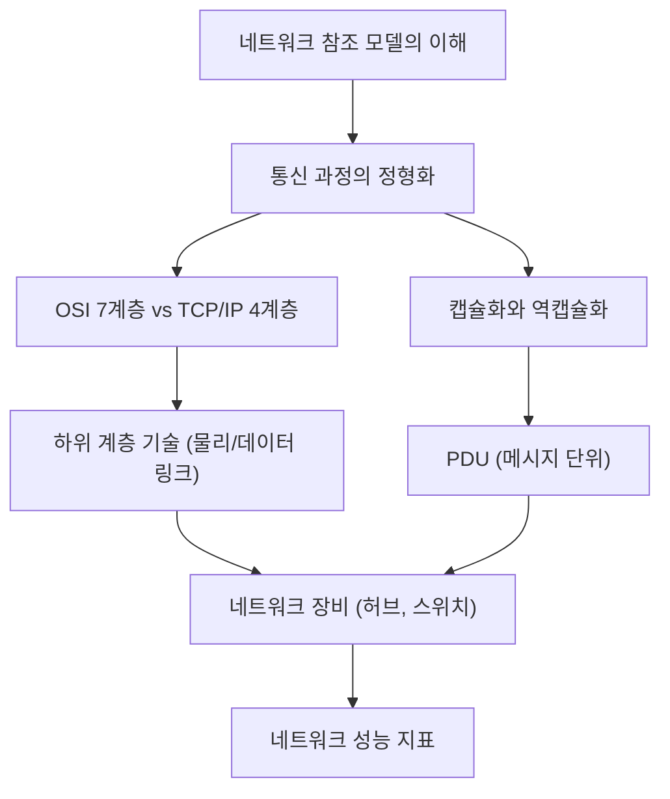

  

## 1. 개요

## 1.1 서론

네트워크 통신은 복잡한 과정이지만, 이를 체계적으로 이해하기 위해 **네트워크 참조 모델**이라는 개념이 사용됩니다. 이 모델들은 통신 과정을 여러 단계(계층)로 나누어 설명하며, 각 계층의 역할과 프로토콜을 이해하는 데 도움을 줍니다. 본 노트는 이러한 네트워크 참조 모델의 기본 개념부터, 데이터가 실제로 어떻게 전송되고 처리되는지(캡슐화/역캡슐화), 그리고 네트워크 장비(허브, 스위치)와 성능 지표(트래픽, 대역폭)에 이르기까지, 제공된 자료들을 종합하여 **흐름에 따라 쉽게 이해**할 수 있도록 정리했습니다. ==네트워크 참조 모델은 이론적 이해를 돕는 밑그림이며, 실제 동작은 프로토콜과 장비에 의해 이루어진다는 점==을 명확히 하는 것이 중요합니다.

  

## 1.2 전체 구조

  

## 2. 네트워크 참조 모델의 이해와 구성 요소

  

## 2.1 네트워크 통신 과정의 계층적 표현

네트워크에서 패킷을 주고받는 과정은 택배를 주고받는 과정과 유사하며, 이 과정은 **정형화된 단계**를 거치고 **계층적**으로 표현될 수 있습니다. ==네트워크 참조 모델==은 이러한 통신이 이루어지는 각 과정을 계층으로 나눈 구조를 의미합니다.   

  

- **송신 과정 (위에서 아래로):** 데이터를 준비하고 포장하는 과정이 위 계층에서 아래 계층으로 순차적으로 진행됩니다.   
    
- **수신 과정 (아래에서 위로):** 수신된 데이터를 확인하고 처리하는 과정은 송신 과정의 정확히 반대 순서로, 아래 계층에서 위 계층으로 진행됩니다.   
    
- **대칭적 표현:** 송신 과정과 수신 과정은 서로 반대 과정으로 이루어지며 대칭적으로 표현될 수 있습니다.   
    

  

## 2.2 네트워크 참조 모델의 존재 이유

네트워크 참조 모델이 존재하는 주된 이유는 네트워크의 **구성 및 설계 용이성**과 **문제 진단 및 해결의 용이성** 때문입니다.   

  

- **구성 및 설계 용이:** 각 계층별로 수행해야 할 역할이 명확하게 정해져 있어, 목적에 맞는 프로토콜과 장비를 계층별로 배치하여 네트워크를 설계하기 수월해집니다.   
    
- **문제 진단 및 해결 용이:** 통신 과정이 계층적으로 정형화되어 있어, 문제가 발생했을 때 최하위 계층부터 순차적으로 확인하며 원인을 짐작하고 해결하기가 수월해집니다.   
    

  

## 2.3 OSI 7계층 모델

OSI 모델은 국제 표준화 기구(ISO)에서 만든 네트워크 참조 모델로, 총 7개의 계층으로 구성되어 있습니다.   

  

|   |   |   |
|---|---|---|
|**계층 번호**|**계층 이름**|**주요 역할 및 특징**|
|7계층|응용 계층 (Application)|사용자 및 응용 프로그램에 실질적인 네트워크 서비스 제공. 프로그램과 가장 많이 맞닿아 있음.|
|6계층|표현 계층 (Presentation)|문자 코드를 컴퓨터가 이해하는 코드로 변환(인코딩), 압축, 암호화 등 번역가 역할 수행.|
|5계층|세션 계층 (Session)|통신하는 호스트의 응용 프로그램 간의 **연결 상태(세션)**를 관리.|
|4계층|전송 계층 (Transport)|**신뢰성 있고 안전성 있는 전송**을 담당. 패킷의 신뢰성 향상 기술 및 사용자 프로세스 식별을 위한 **포트** 정보 활용.|
|3계층|네트워크 계층 (Network)|**랜(LAN) 간의 통신**을 담당. **IP 주소**와 **라우팅** 기술 포함.|
|2계층|데이터 링크 계층 (Data Link)|네트워크상의 **주변 장치 간 정보**를 올바르게 주고받기 위한 계층. **MAC 주소**를 이용하며, 오류 확인 기능 수행. LAN 관련 기술 정의.|
|1계층|물리 계층 (Physical)|OSI 모델의 최하단. **1과 0의 비트 신호**가 전기, 빛, 전파 등 다양한 통신 매체를 통해 주고받는 방식 정의.|

  

## 2.4 TCP/IP 모델

TCP/IP 모델은 인터넷 프로토콜 스위트라고도 불리며, 이름처럼 **TCP와 IP 프로토콜**이 중심이 되는 4개 층으로 구성되어 있습니다.   

  

- **실용성 강조:** OSI 모델이 이론적 기술에 중점을 둔다면, TCP/IP 모델은 구체적인 프로토콜에 중점을 두어 **실용성**을 강조합니다.   
    
- **계층 비교:** TCP/IP 모델은 OSI 모델과 유사한 역할을 수행하지만, 계층 간의 비교는 기술적으로 엄밀하지 않을 수 있습니다.   
    

  

|   |   |
|---|---|
|**TCP/IP 계층**|**OSI 계층과의 유사 역할**|
|응용 계층 (Application)|세션, 표현, 응용 계층 합친 역할|
|전송 계층 (Transport)|전송 계층 (4계층)|
|인터넷 계층 (Internet)|네트워크 계층 (3계층)|
|네트워크 액세스 계층 (Network Access)|데이터 링크 계층 (2계층) 유사. 물리 계층 역할은 보통 포함하지 않음.|

  

- **실제 학습 기준:** 강의 및 서적에서는 TCP/IP 모델을 기준으로 설명하되, 물리 계층 역할을 포함한 **확장된 TCP/IP 모델**을 기준으로 학습을 진행합니다.   
    

  

## 2.5 네트워크 참조 모델에 대한 오해와 실무적 관점

네트워크 참조 모델은 네트워크를 작동시키는 **주체가 아니며**, 프로토콜처럼 반드시 지켜야 하는 규칙도 아닙니다. ==이는 네트워크 구성 및 설계를 용이하게 하기 위한 '참조용 밑그림'에 불과합니다.==   

  

- **실무와의 괴리:** 모든 프로토콜이나 장비가 참조 모델의 특정 계층에 완벽하게 대응되지 않으며, 장비(예: 라우터)는 하위 계층 기능을 포괄하는 경우가 많아 혼란을 줄 수 있습니다.   
    
- **실질적 학습 대상:** 개발자 입장에서 실질적인 네트워크 학습 대상은 모델 자체가 아니라, **네트워크를 작동시키는 주체인 프로토콜이나 네트워크 장비**여야 합니다.   
    
- **개발자의 인프라 지식 중요성:** 최근 **인프라를 코드로 다루는(Infrastructure as Code)** 시대가 오면서, 네트워크 참조 모델의 낮은 계층(2장, 3장) 지식(예: IP 주소, 라우팅)이 개발자 업무에 밀접하게 요구되고 있습니다.   
    

  

## 3. 데이터의 흐름: 캡슐화와 역캡슐화

  

## 3.1 캡슐화 (Encapsulation)

캡슐화는 메시지가 송신될 때, **위 계층에서 아래 계층으로 내려가면서** 각 계층의 프로토콜 목적에 맞는 **헤더(Header)**가 덧붙여지는 과정을 의미합니다.   

  

- **과정:** 응용 계층부터 시작하여 전송, 네트워크 계층을 지나면서 해당 계층의 헤더가 순차적으로 추가됩니다.   
    
- **데이터 링크 계층의 특징:** 데이터 링크 계층에서는 헤더뿐만 아니라 **트레일러(Trailer)**도 함께 붙습니다.   
    
- **택배 비유:** 보내고자 하는 물품(페이로드)에 송장(헤더)을 붙이고, 이 전체를 다시 큰 박스(하위 계층의 페이로드)에 담는 과정에 비유할 수 있습니다.   
    
- **계층 간 관계:** 상위 계층의 (헤더 + 페이로드)는 바로 아래 계층에서는 **페이로드**가 됩니다.   
    

  

## 3.2 역캡슐화 (Decapsulation)

역캡슐화는 송신 과정과 정확히 반대로, 수신 과정에서 **아래 계층에서 위 계층으로 올라가면서** 캡슐화 과정에서 붙었던 **헤더(및 트레일러)를 제거**해 나가는 과정입니다.   

  

- **과정:** 데이터 링크 계층에서 헤더와 트레일러가 제거되고, 이후 네트워크, 전송 계층을 거치며 해당 계층의 헤더가 순차적으로 제거됩니다.   
    
- **최종 결과:** 모든 헤더가 제거된 후, 최종적으로 프로그램이 받는 데이터는 처음에 보내고자 했던 **실질적인 데이터(페이로드)**가 됩니다.   
    

  

## 3.3 PDU (Protocol Data Unit)

각 계층에서 송수신되는 메시지의 단위를 **PDU(Protocol Data Unit)**라고 부릅니다.   

  

|   |   |   |
|---|---|---|
|**계층**|**PDU 명칭**|**비고**|
|응용/세션/표현 계층|데이터 (Data)|편의상 지칭|
|전송 계층|세그먼트 (Segment) 또는 데이터그램 (Datagram)|TCP 사용 시 세그먼트, UDP 사용 시 데이터그램|
|네트워크 계층|패킷 (Packet) 또는 데이터그램|IP 패킷으로 구분하여 지칭하기도 함.|
|데이터 링크 계층|프레임 (Frame)||
|물리 계층|비트 (Bit)||

  

## 4. 물리 계층 및 데이터 링크 계층 기술과 장비

  

## 4.1 이더넷 기술과 표준 (물리/데이터 링크 계층)

**이더넷(Ethernet)**은 현대 유선 LAN 환경에서 가장 대중적으로 사용되는 기술로, 물리 계층의 통신 매체 규격과 데이터 링크 계층의 프레임 형태 등을 정의합니다.   

  

- **IEEE 802.3 표준:** 이더넷 기술은 국제 표준인 **IEEE 802.3**으로 정의되며, 이는 이더넷 관련 다양한 표준들의 모음입니다.   
    
- **표준 구분:** 다양한 표준을 구분하기 위해 IEEE 802.3 뒤에 버전 알파벳(예: 802.3u, 802.3ab)이 붙습니다.   
    
- **통신 매체 표기법:** 케이블을 지칭할 때는 IEEE 표준명 대신 **[전송 속도] + [베이스] + [추가 특성]** 형태로 표기하는 것이 일반적입니다.   
    
    - **전송 속도:** 숫자는 Mbps를 의미하며, 'G'가 붙으면 Gbps를 의미합니다. (예: 100G는 100Gbps)   
        
    - **베이스:** 변조 타입을 의미하며, 유선 통신 매체에서는 대부분 '베이스(Base)'로 표기됩니다.   
        
    - **추가 특성:** 전송 거리, 인코딩 방식, 레인 수 등이 명시될 수 있으나, **통신 매체의 종류**를 알 수 있는 알파벳이 가장 중요합니다.   
        
        - **T:** 트위스티드 페어 케이블 (Twisted Pair)   
            
        - **C:** 동축 케이블 (Coaxial Cable)   
            
        - **S 또는 L:** 광섬유 케이블 (Fiber Optic Cable)   
            
        
    

  

## 4.2 물리 계층 장비: 허브 (Hub)

허브는 **물리 계층(1계층)**의 대표적인 네트워크 장비로, 주소 개념이 없어 메시지에 대한 조작이나 판단을 전혀 하지 못합니다.   

  

- **동작 방식:** 메시지를 전달받으면, 주소를 모르기 때문에 **모든 포트로 메시지를 그대로 내보내는(중계하는)** 특징이 있습니다.   
    
- **통신 방식 (반이중):** 허브는 **반이중(Half-Duplex)** 방식으로 통신합니다. 이는 무전기처럼 한 번에 한쪽 방향으로만 송수신이 가능함을 의미하며, 동시에 통신 시 **충돌(Collision)**이 발생합니다.   
    
- **콜리전 도메인:** 허브에 연결된 모든 호스트는 **동일한 콜리전 도메인**에 속하며, 호스트가 많아질수록 충돌 가능성이 높아집니다.   
    
- **CSMA/CD:** 스위치 없이 허브 환경에서 충돌을 완화하기 위해 사용하는 프로토콜로, **Carrier Sense Multiple Access with Collision Detection**의 약자입니다.   
    
    - **CS (Carrier Sense):** 메시지 전송 전, 매체에 다른 메시지가 없는지 검사합니다.   
        
    - **MA (Multiple Access):** 여러 호스트가 동시에 접근할 수 있습니다.   
        
    - **CD (Collision Detection):** 충돌 발생 시 **잼 신호(Jamming Signal)**를 보내 전송을 중단하고, 임의의 시간(랜덤 시간) 대기 후 재전송합니다.   
        
    
- **리피터:** 허브와 마찬가지로 물리 계층 장비이며, 전기 신호의 감소/왜곡을 막기 위해 신호를 증폭만 시키는 장비입니다.   
    

  

## 4.3 데이터 링크 계층 장비: 스위치 (Switch)

스위치는 **데이터 링크 계층(2계층)**의 대표적인 장비로, **MAC 주소 개념**을 이해하고 판단할 수 있습니다.   

  

- **허브와의 차이점:** 스위치는 MAC 주소를 통해 수신지 호스트가 연결된 포트로만 프레임을 전달(포워딩)하며, 불필요한 트래픽을 막아 **충돌 도메인을 줄입니다**.   
    
- **통신 방식 (전이중):** 스위치는 **전이중(Full-Duplex)** 통신을 지원하여, 동시에 송수신이 가능하므로 CSMA/CD 프로토콜이 근본적으로 필요하지 않습니다.   
    
- **L2 스위치:** 일반적으로 스위치라고 하면 2계층에서 사용되는 **L2 스위치**를 의미합니다.   
    

  

## 스위치의 주요 기능: MAC 주소 학습 및 테이블 관리

스위치의 핵심 기능은 **MAC 주소 학습**과 **VLAN** 기능입니다.   

  

1. **MAC 주소 학습:**
    
    - 스위치는 수신된 프레임의 **송신지 MAC 주소 필드**를 보고, 해당 MAC 주소가 어느 포트에 연결되어 있는지 학습합니다.   
        
    - 학습된 연관 관계는 **MAC 주소 테이블**에 저장됩니다.   
        
    
2. **플러딩 (Flooding):**
    
    - MAC 주소 테이블에 목적지 MAC 주소에 대한 정보가 없을 경우, 허브처럼 **모든 포트로 프레임을 전송**하는 행위입니다.   
        
    
3. **포워딩 (Forwarding) / 필터링:**
    
    - 학습이 완료되어 목적지 MAC 주소와 연결된 포트를 알게 되면, 해당 포트로만 프레임을 내보냅니다(포워딩).   
        
    
4. **에이징 (Aging):**
    
    - MAC 주소 테이블에 등록된 항목이 일정 시간 동안 프레임을 받지 못하면, 해당 항목을 **자동으로 삭제**하는 기능입니다.   
        
    

  

## 스위치의 주요 기능: VLAN (Virtual LAN)

VLAN은 **논리적으로 나누어진 가상의 LAN**을 의미하며, 한 대의 물리적 스위치로 여러 개의 LAN을 구성할 수 있게 합니다.   

  

- **목적:** 불필요한 트래픽(특히 **브로드캐스트 메시지**)을 분배하여 네트워크 성능 저하를 방지합니다.   
    
- **네트워크 분리:** VLAN이 다르면 다른 네트워크로 간주되므로, 다른 VLAN 간 통신을 위해서는 3계층 이상의 장비(라우터 등)가 필요합니다.   
    
- **VLAN 종류:**
    
    - **포트 기반 VLAN (정적 VLAN):** 스위치의 특정 포트에 특정 VLAN을 할당하는 방식.   
        
    - **MAC 기반 VLAN (동적 VLAN):** 사전에 설정된 MAC 주소에 따라 호스트가 속할 VLAN을 결정하는 방식.   
        
    

  

## 4.4 물리 계층의 통신 매체 (케이블)

물리 계층에서 사용되는 통신 매체(케이블)는 크게 트위스티드 페어 케이블과 광섬유 케이블이 있습니다.   

  

## 트위스티드 페어 케이블 (Twisted Pair Cable)

구리선으로 이루어져 있으며 전기 신호를 주고받는 케이블입니다.   

  

- **구조:** RJ-45 커넥터와 내부의 꼬인 구리선 쌍(트위스트 페어)으로 구성됩니다.   
    
- **노이즈 민감성:** 구리선은 노이즈에 민감하므로, 노이즈 방지를 위해 **실드(Shield)**를 사용합니다.   
    
- **실드 종류에 따른 분류:**
    
    - **UTP (Unshielded):** 실드 없음.   
        
    - **STP (Shielded):** 꼬아진 철사(브레이드 쉴드) 사용.   
        
    - **FTP (Foiled):** 포일 실드 사용.   
        
    
- **카테고리:** 카테고리(예: 5, 5e, 6)가 높을수록 최신 이더넷 규격을 지원하며 일반적으로 더 빠른 전송이 가능합니다.   
    

  

## 광섬유 케이블 (Optical Fiber Cable)

빛 신호를 이용하여 정보를 주고받는 케이블로, 속도가 매우 빠르고 먼 거리 전송에 적합하며 노이즈 영향이 적습니다.   

  

- **내부 구조:** 코어(빛이 실제로 흐르는 중심부)와 코어를 감싸 빛이 갇히도록 하는 클래딩으로 구성됩니다.   
    
- **종류 (코어 지름 기준):**
    
    - **싱글 모드 광섬유 (SMF):** 코어 지름이 매우 좁아(8~10μm) 빛이 직진 경로(모드 1개)로 이동하여 장거리 전송에 적합하며 신호 손실이 적습니다. 주로 장파장 빛 사용. 비용이 높음.   
        
    - **멀티모드 광섬유 (MMF):** 코어 지름이 넓어 빛이 여러 경로(모드 여러 개)로 이동 가능합니다. 싱글 모드보다 신호 손실이 크고 장거리 전송에 부적합하며, 주로 단파장 빛 사용.   
        
    
- **구분:** 싱글 모드는 주로 **노란색/파란색** 본체, 멀티모드는 **오렌지색/아쿠아색** 본체로 색상을 통해 구분할 수 있습니다.   
    

  

## 4.5 네트워크 인터페이스 카드 (NIC)

NIC은 호스트와 통신 매체를 연결하는 **하드웨어 장비**로, 네트워크 참여를 위한 관문 역할을 합니다.   

  

- **역할:** 통신 매체(전기, 빛 등)의 신호를 호스트가 이해할 수 있는 디지털 정보로 변환하거나 그 반대로 변환합니다.   
    
- **MAC 주소 인식:** NIC에는 **MAC 주소**가 부여되어 있으며, NIC은 이 주소를 인식하여 수신된 프레임의 목적지 MAC 주소가 자신과 일치하는지 확인하고 처리 여부를 결정합니다.   
    
- **성능 영향:** NIC이 지원하는 속도에 따라 호스트가 정보를 주고받는 속도가 달라지므로, 고성능을 요구하는 환경에서는 고성능 NIC 증설이 필요합니다.   
    

  

## 5. 네트워크 성능 지표

  

## 5.1 트래픽과 성능 지표의 정의

**트래픽**은 네트워크 내의 정보량(도로의 자동차 양과 유사)을 의미하며, 주로 특정 시점에 노드를 경유하는 정보량으로 측정됩니다.   

  

- **다루는 이유:** 노드가 처리할 수 있는 트래픽 양은 한정되어 있어, 과도한 트래픽은 **과부하로 인한 성능 저하**를 유발하기 때문입니다.   
    

  

네트워크 성능을 판단하는 대표적인 지표는 다음과 같습니다.   

  

- **처리율 (Throughput, 스루풋):** 단위 시간당 네트워크를 통해 **실제로 전송되는 정보량**을 의미하며, 실시간성이 강조될 때 활용됩니다. 단위는 Bps, Kbps, Mbps, Gbps 등이 사용됩니다.   
    
- **패킷 처리율 (PPS, Packets Per Second):** 1초당 처리되는 패킷의 개수를 나타내는 지표입니다.   
    
- **대역폭 (Bandwidth):** 컴퓨팅 영역에서 **단위 시간 동안 통신 매체를 통해 송수신할 수 있는 최대 정보량**을 의미합니다. 정보를 주고받을 수 있는 '폭'에 비유할 수 있습니다.   
    
    - 대역폭은 통신 매체의 역량뿐만 아니라, RAM이나 GPU 등 다양한 하드웨어의 최대 데이터 송수신 역량을 나타내는 데 범용적으로 사용됩니다.   
        
    
- **패킷 손실 (Packet Loss):** 올바르게 전송되지 못하고 유실된 패킷의 개수 또는 비율을 나타냅니다. (예: `ping` 명령어 결과에서 확인 가능)