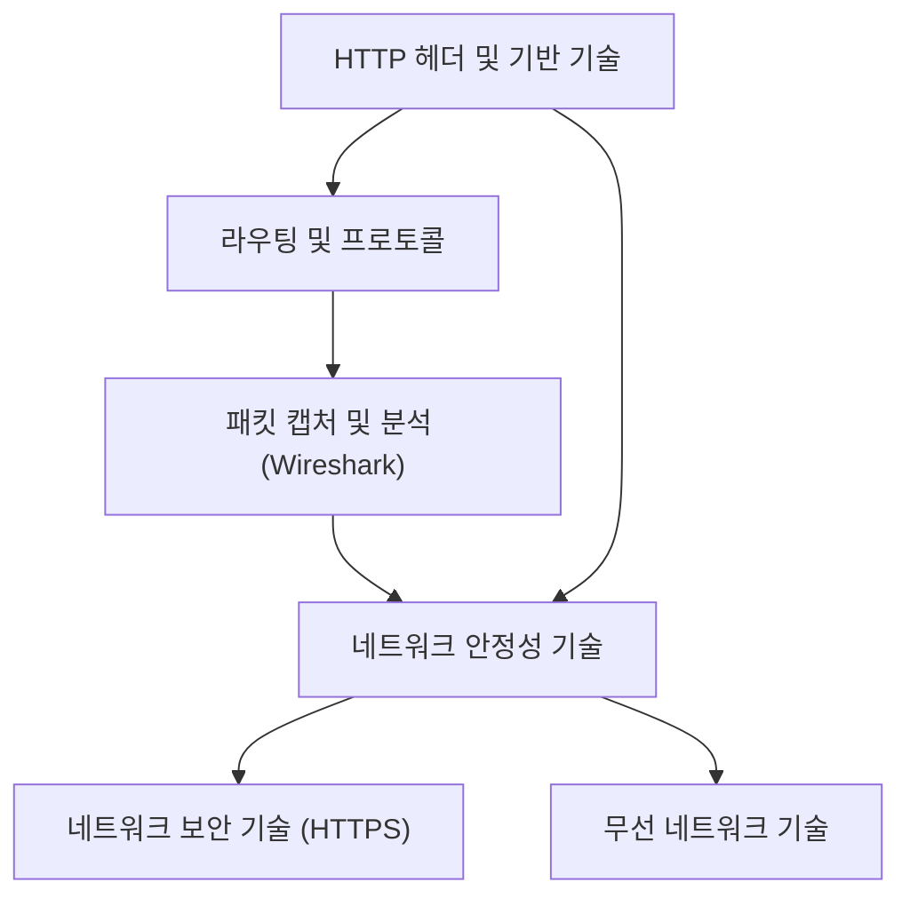

  

## 1. 개요

  

## 1.1 서론

네트워크 통신은 우리가 사용하는 모든 디지털 서비스의 기반입니다. 이번 노트는 **HTTP 헤더와 기반 기술, 라우팅, 패킷 분석, 그리고 네트워크 안정성 및 보안 기술**에 대한 다양한 자료들을 종합하여, 각 개념들이 어떻게 연결되고 작동하는지 깊이 있게 이해할 수 있도록 돕기 위해 작성되었습니다. 네트워크의 기초부터 응용 계층까지의 핵심 원리와 실제 분석 도구 사용법을 꼼꼼하게 정리하여, 독자들이 네트워크 동작 원리를 명확하게 파악하고 실무에 적용할 수 있는 인사이트를 얻도록 돕는 것이 목표입니다.

  

## 1.2 전체 구조

  

## 2. HTTP 헤더와 기반 기술 이해하기

HTTP 메시지는 시작 라인, 필드 라인(헤더), 메시지 본문으로 구성됩니다. 필드 라인에 명시되는 다양한 **HTTP 헤더**들은 요청과 응답의 세부 정보를 담고 있으며, 이를 기반으로 캐시, 쿠키, 콘텐츠 협상 등의 중요한 기술들이 구현됩니다.   

  

## 2.1 사전 지식 없이 이해 가능한 주요 HTTP 헤더

요청, 응답, 또는 양쪽 모두에서 자주 사용되는 헤더들이 있으며, 이들은 통신 당사자나 메시지 내용에 대한 기본적인 정보를 제공합니다.   

  

|   |   |   |
|---|---|---|
|**구분**|**헤더 이름**|**주요 역할**|
|요청 전용|Host|요청을 보낼 호스트(도메인 및 포트) 지정|
|요청 전용|User-Agent|클라이언트 프로그램(웹 브라우저 등) 및 버전 정보 명시|
|요청 전용|Referer|클라이언트가 이전에 머물렀던 URL 정보 제공 (유입 경로 파악)|
|요청 전용|Authorization|클라이언트의 인증 정보(타입 및 인증 정보) 전송|
|응답 전용|Server|요청을 처리한 서버 측 소프트웨어 정보 명시|
|응답 전용|Allow|클라이언트에게 허용된 HTTP 메서드 목록 전달|
|응답 전용|Retry-After|상태 코드 503(Service Unavailable) 시, 자원 재사용 가능 시각/날짜 전달|
|응답 전용|Location|새로운 자원의 위치(URL)를 알려주거나 리다이렉션 시 사용|
|응답 전용|WWW-Authenticate|상태 코드 401(Unauthorized) 시, 클라이언트에게 인증 방법 설명|
|공통|Date|메시지가 생성된 날짜와 시각 정보 포함|
|공통|Connection|클라이언트-서버 간 연결 방식(Keep-Alive 또는 Close) 명시|
|공통|Content-Length|메시지 본문의 바이트 단위 길이(크기) 명시|

  

- **User-Agent 헤더의 상세 정보:**
    
    - 사용하는 웹 브라우저가 모질라와 호환되는지 여부.   
        
    - 운영 체제(OS) 및 아키텍처 정보 (예: 윈도우 NT 10.0, 64x64).   
        
    - **렌더링 엔진** 정보: 웹 브라우저에서 시각적 요소를 구현하는 구성 요소의 버전.   
        
    - 사용 중인 웹 브라우저 종류와 버전.   
        
    

  

- **Authorization와 WWW-Authenticate를 통한 HTTP Basic 인증 과정:**
    
    - 인증되지 않은 클라이언트가 서버에 요청을 보내면, 서버는 **401 Unauthorized** 상태 코드와 함께 **WWW-Authenticate** 헤더(예: `Basic`)를 반환합니다.   
        
    - 클라이언트는 사용자로부터 받은 아이디/비밀번호를 **Base64 인코딩**하여 **Authorization** 헤더에 담아 재요청합니다 (예: `Authorization: Basic [인코딩된 값]`).   
        
    - 서버가 인증 정보를 확인하여 유효하면 **200 OK**와 함께 자원을 반환하고, 유효하지 않으면 다시 401을 반환합니다.   
        
    

  

## 2.2 표현 헤더 (Content-Type, Content-Language, Content-Encoding)

이 세 가지 헤더는 메시지 본문(Representation)을 어떻게 표현할지에 대한 정보를 담고 있으며, 함께 묶여 다뤄집니다.   

  

- **Content-Type:** 메시지 본문에 사용된 **미디어 타입**을 나타냅니다. HTTP는 미디어 독립적이므로 텍스트, HTML, PNG 등 다양한 자원 종류를 표현할 수 있습니다.   
    
- **Content-Language:** 메시지 본문에 사용된 **언어**를 명시하며, **언어 태그** 형식으로 표현됩니다.
    
    - 언어 태그는 보통 `언어 코드-국가 코드` 조합으로 이루어집니다 (예: 미국 영어는 `en-US`).   
        
    
- **Content-Encoding:** 메시지 본문이 압축되거나 변환되었을 때, 그 방식을 나타냅니다 (예: `gzip`, `deflate`). 수신자가 이를 해제할 수 있도록 돕습니다.   
    

  

## 2.3 HTTP 기반 기술: 캐싱 (Caching)

캐싱은 서버 응답 자원의 사본을 클라이언트가 임시 저장하여, 추후 요청 시 빠르게 활용하고 대역폭 낭비 및 응답 지연을 방지하는 기술입니다.   

  

- **캐시의 종류:**
    
    - **개인 전용 캐시 (Private Cache):** 각 클라이언트(웹 브라우저)에 저장됩니다.   
        
    - **공용 캐시 (Public Cache):** 여러 클라이언트가 공유하는 중간 서버에 위치합니다.   
        
    

  

- **캐시 신선도 (Cache Freshness) 관리:**
    
    - 캐시된 데이터는 원본과 달라질 수 있으므로, 클라이언트는 캐시의 신선도를 수시로 확인해야 합니다.   
        
    - **유효 기간 설정:** 응답 헤더의 `Expires`나 `Cache-Control: max-age=<초>`를 통해 캐시 사용 가능 시간을 지정합니다.   
        
    - **날짜 기반 검사:** 유효 기간 만료 시, 클라이언트는 `If-Modified-Since` 헤더에 특정 날짜를 명시하여 서버에 원본 변경 여부를 문의합니다.   
        
        - 서버가 변경이 없다고 판단하면 **304 Not Modified** 상태 코드를 반환하며, 이때 응답 헤더에 `Last-Modified` (최종 변경 시점)가 포함될 수 있습니다.   
            
        
    - **ETag 기반 검사:** 자원의 버전을 식별하는 **엔티티 태그(ETag)**를 사용합니다.
        
        - 클라이언트는 `If-None-Match` 헤더에 ETag 값을 담아 서버에 "이 ETag 값과 일치하는 자원이 있니?"라고 문의합니다.   
            
        - 자원이 변경되지 않았다면 서버는 **304 Not Modified**를 반환하고, 변경되었다면 새로운 ETag와 함께 자원을 응답합니다.   
            
        
    

  

## 2.4 HTTP 기반 기술: 쿠키 (Cookie)와 웹 스토리지

HTTP의 **스테이트리스(Stateless)** 특성을 보완하고 클라이언트의 상태를 유지하기 위해 쿠키가 사용됩니다.   

  

- **쿠키의 역할 및 전송:**
    
    - 쿠키는 서버가 생성하여 클라이언트 측에 저장하는 이름/값 쌍의 데이터 덩어리입니다.   
        
    - 서버는 응답 시 `Set-Cookie` 헤더로 쿠키를 전송하고, 클라이언트는 이후 요청 시 `Cookie` 헤더로 쿠키를 포함하여 자동 전송합니다.   
        
    - **세션 인증:** 쿠키를 활용하여 서버가 클라이언트에게 부여한 **세션 ID**를 저장하고, 이후 요청 시 이 ID를 통해 번거로운 재인증 없이 상태를 유지합니다.   
        
    

  

- **쿠키 속성:** 쿠키의 사용 범위를 제한하거나 보안을 강화합니다.   
    
    - **Domain/Path:** 쿠키가 사용될 수 있는 도메인과 경로를 제한합니다.   
        
    - **Max-Age/Expires:** 쿠키의 유효 기간을 초 단위(`Max-Age`) 또는 특정 날짜(`Expires`)로 지정합니다.   
        
    - **보안 속성:**
        
        - **Secure:** HTTPS 프로토콜에서만 쿠키를 전송하도록 제한합니다.   
            
        - **HttpOnly:** 자바스크립트 등 HTTP 송수신 이외의 방법으로 쿠키에 접근하는 것을 막아 보안을 강화합니다.   
            
        
    

  

- **웹 스토리지 (Web Storage):**
    
    - 쿠키와 유사하게 클라이언트 상태 정보를 저장하지만, **용량이 더 크고** 서버로 **자동 전송되지 않는** 차이점이 있습니다.   
        
    - **Local Storage:** 별도 삭제 없으면 반영구적으로 저장됩니다.   
        
    - **Session Storage:** 웹 브라우저가 열려 있는 세션 동안만 유지됩니다.   
        
    

  

## 2.5 HTTP 기반 기술: 콘텐츠 협상 (Content Negotiation)

콘텐츠 협상은 **같은 URI**에 대해 클라이언트가 선호하는 형태(표현)를 서버가 제공해 주는 기술입니다.   

  

- **표현 (Representation):** 송수신 가능한 자원의 형태를 의미하며, 엄밀히 말해 클라이언트가 응답받는 것은 자원 자체가 아닌 **자원의 표현**입니다.   
    
- **클라이언트 요청 헤더:** 클라이언트가 선호하는 표현을 서버에 알리기 위해 사용합니다.   
    
    - **Accept:** 선호하는 미디어 타입 지정 (예: `text/html`).   
        
    - **Accept-Language:** 선호하는 자연어 지정 (언어 태그 사용).   
        
    - **Accept-Encoding/Accept-Charset:** 선호하는 압축 방식 또는 문자 인코딩 지정.   
        
    

  

- **선호도 우선순위 (Q Value):**
    
    - 클라이언트가 여러 선호 항목을 가질 경우, **Q 값(Quality Value)**을 사용하여 우선순위를 반영합니다.   
        
    - Q 값의 범위는 0부터 1까지이며, **값이 클수록 우선순위가 높습니다**. 값이 생략되면 1로 간주됩니다.   
        
    

  

## 3. 라우팅의 분류와 프로토콜

라우팅 테이블을 만드는 방식에 따라 **정적 라우팅**과 **동적 라우팅**으로 분류됩니다.   

  

## 3.1 정적 라우팅의 한계

정적 라우팅은 관리자가 수동으로 라우팅 테이블 항목을 설정하는 방식입니다.   

  

- **단점:**
    
    - 네트워크 규모가 커지거나 관리할 라우터가 많아지면 관리가 어렵고 **휴먼 에러** 발생 가능성이 높습니다.   
        
    - 경로상에 문제가 발생했을 때 **유연성이 떨어져** 경로 우회가 어렵습니다. 문제가 생길 때마다 수동으로 테이블을 변경해야 합니다.   
        
    

  

## 3.2 동적 라우팅과 AS (Autonomous System)

동적 라우팅은 **라우팅 프로토콜**을 기반으로 라우터들이 경로 정보를 교환하며 라우팅 테이블을 **자동으로 업데이트**하는 방식입니다.   

  

- **AS (Autonomous System):** 라우터들의 집단으로, 라우팅 프로토콜의 단위가 됩니다. 각 AS에는 고유한 **AS 번호**가 할당됩니다.   
    
    - AS 내부 라우팅과 AS 간 라우팅이 가능하며, AS 간 통신 시에는 **AS 경계 라우터(ASBR)**가 사용됩니다.   
        
    

  

- **라우팅 프로토콜 분류:** AS 기반으로 프로토콜이 분류됩니다.   
    
    - **IGP (Interior Gateway Protocol):** AS **내부** 최적 경로 탐색 (예: RIP, OSPF).   
        
    - **EGP (Exterior Gateway Protocol):** AS **간** 최적 경로 탐색 (예: BGP).   
        
    

  

## 3.3 주요 라우팅 프로토콜 상세

|   |   |   |   |   |
|---|---|---|---|---|
|**프로토콜**|**분류**|**기반 알고리즘**|**메트릭 기준**|**특징**|
|**RIP**|IGP|거리 벡터 (Distance Vector)|**홉 수** (경유한 라우터 수)|홉 수가 적을수록 최적 경로로 판단.|
|**OSPF**|IGP|링크 상태 (Link State)|**대역폭** 기반 메트릭|네트워크 상태를 그래프(링크 상태 데이터베이스)로 저장 후 최단 경로 알고리즘 수행 (Open Shortest Path First).|
|**BGP**|EGP|경로 벡터 (Path Vector)|**AS 경로**, 로컬 프레퍼런스 등 다양한 속성 및 **정책**|AS 간 라우팅에 사용되며, 경로 결정 과정이 복잡하고 정책의 영향을 많이 받음.|

  

- **BGP 속성:**
    
    - **AS Path:** 메시지가 거쳐온 AS들의 목록.   
        
    - **Next Hop:** 다음 라우터의 IP 주소.   
        
    - **Local Preference (지역 선호도):** 외부 경로 선택 시 내부에서 선호하는 경로를 명시하는 **명시적 메트릭**으로, AS 패스보다 큰 영향을 미침. AS 관리 주체의 **정책**에 따라 값이 결정됨.   
        
    

  

## 4. Wireshark를 이용한 패킷 분석 실습

**Wireshark**는 네트워크 상에서 송수신되는 패킷을 캡처하고 분석할 수 있는 대표적인 패킷 캡처 프로그램입니다.   

  

## 4.1 Wireshark 기본 화면 구성

Wireshark 실행 시 나타나는 메인 화면은 크게 세 부분으로 구성됩니다.   

  

1. **패킷 목록 창 (빨간색 박스):** 캡처된 패킷들의 요약 정보(번호, 시간, Source/Destination IP, Protocol, Info)를 표 형태로 보여줍니다.   
    
2. **패킷 상세 창 (파란색 박스):** 선택된 패킷이 **캡슐화**된 계층별 헤더 정보를 보여줍니다. (예: HTTP -> TCP -> IP -> Ethernet).   
    
3. **패킷 데이터 창 (초록색 박스):** 선택된 패킷의 실제 데이터(Raw Data)를 16진수 형태로 보여주며, 상세 창에서 특정 계층을 클릭하면 해당 부분이 하이라이트됩니다.   
    

  

- **캡처 시작/중단:** 지그재그 모양이 보이는 **네트워크 인터페이스**를 선택하고 캡처를 시작하며, 빨간색 버튼으로 중단할 수 있습니다.   
    

  

## 4.2 IP 프로토콜 분석 (IPv4 및 IPv6)

**IP 프로토콜의 주요 목적**은 주소 지정과 **단편화(Fragmentation)**입니다.   

  

- **IPv4 단편화 분석 (IP Fragmentation.pcap):**
    
    - 단편화 시 **Identification (식별자)** 필드가 동일한 패킷들은 같은 데이터에서 분할된 것임을 나타냅니다.   
        
    - **More Fragments (MF) 플래그:** 이 비트가 1이면 뒤에 더 단편화된 패킷이 있음을 의미합니다.   
        
    - **Fragment Offset (단편화 오프셋):** 해당 단편이 원본 데이터에서 얼마나 떨어져 있는지를 나타냅니다.   
        
    - **ICMP 분석:** 7번 패킷(타입 8, 코드 0)은 **Echo Request (에코 요청)**, 14번 패킷(타입 0, 코드 0)은 **Echo Reply (에코 응답)**임을 확인할 수 있습니다.   
        
    

  

- **IPv6 주소 표기 및 단편화 (IPv6 Fragmentation.pcap):**
    
    - IPv6 주소는 128비트이며, 16진수 4자리씩 콜론으로 구분된 8개 그룹으로 표기되지만, 연속된 0 그룹은 `::`로 **축약**하여 표기할 수 있습니다.   
        
    - IPv6의 단편화는 **확장 헤더**를 통해 이루어지며, 단편화된 패킷의 **Next Header** 필드는 **Fragment Header**를 가리킵니다.   
        
    - IPv4와 마찬가지로 IPv6 단편화 헤더에도 **Identification, More Fragments, Offset** 필드가 존재합니다.   
        
    - 단편화되지 않은 IPv6 패킷에서 Next Header는 캡슐화된 상위 프로토콜(예: UDP)을 가리킵니다.   
        
    

  

## 4.3 TCP 프로토콜 분석

TCP는 **연결 지향형**이며 **신뢰성 있는 전송**을 보장하는 프로토콜입니다.   

  

- **TCP 3-Way Handshake (Three-Way Handshake.pcap):**
    
    - 연결 수립은 **SYN** (연결 요청) -> **SYN/ACK** (요청 응답) -> **ACK** (확인 응답) 순서로 이루어집니다.   
        
    - **Sequence Number (순서 번호):** 데이터의 순서를 나타내며, ACK 시에는 다음 기대 순서 번호가 됩니다.   
        
    - **Port Number:** 80번 포트는 HTTP에서 주로 사용되는 **Well-Known Port**이며, 클라이언트 측 포트(예: 49859)는 **동적 포트 번호** 범위에 속합니다.   
        
    

  

- **TCP 연결 종료 (Connection Close / 4-Way Handshake):**
    
    - 연결 종료는 **FIN**과 **ACK**를 주고받는 네 단계를 거칩니다 (4-Way Handshake).   
        
    - 처음 FIN을 보내는 쪽은 **액티브 클로즈 호스트**이며, 요청을 받는 쪽은 **패시브 클로즈 호스트**입니다.   
        
    - 액티브 클로즈 호스트는 FIN 전송 후 **TIME_WAIT** 상태로 일정 시간 대기하여, FIN/ACK 유실에 대비합니다.   
        
    

  

- **TCP 재전송 및 빠른 재전송 (TCP Retransmission.pcap):**
    
    - **재전송 (Retransmission):** 잘못 전송되거나 유실된 패킷에 대해 오류 제어로 재전송이 발생합니다.   
        
    - **빠른 재전송 (Fast Retransmission):** **세 번의 중복된 ACK 세그먼트**가 발생했을 때, 유실된 세그먼트를 즉시 재전송하는 기능입니다.   
        
    - Wireshark 필터 `tcp.analysis.duplicate_ack`로 중복 ACK를, `tcp.analysis.retransmission` 또는 `tcp.analysis.fast_retransmission`으로 재전송 패킷을 확인할 수 있습니다.   
        
    

  

## 4.4 HTTP 메시지 분석 (HTTP Request Response.pcap)

HTTP 메시지 분석은 Wireshark 외에 웹 브라우저 개발자 도구로도 가능합니다.   

  

- **HTTP 요청 메시지 (1번 패킷):**
    
    - 첫 줄은 **요청 라인**으로, **메서드(GET)**, 요청 **패스(/)**, **HTTP 버전**이 명시됩니다.   
        
    - **Host 헤더**를 통해 요청 호스트를 알 수 있습니다.   
        
    - `\r
        
    

` (캐리지 리턴 + 라인 피드)는 **줄 바꿈**을 의미합니다.   

- **Referer 헤더**는 이전 요청 자원의 URL을 보여줍니다.   
    

  

- **HTTP 응답 메시지 (2번 패킷):**
    
    - 첫 줄은 **상태 라인**으로, **HTTP 버전, 상태 코드(200)**, 이유 구문(OK)이 명시됩니다.   
        
    - **Content-Type** 헤더를 통해 메시지 본문이 `text/html`임을 알 수 있으며, 이는 HTML 문서임을 의미합니다.   
        
    - 응답 헤더에는 `Date`, `Server`, `Last-Modified`, `ETag` 등이 포함될 수 있습니다.   
        
    

  

## 4.5 Wireshark 필터링 기능

패킷 필터링은 원하는 조건에 맞는 패킷만 조회하는 기능입니다.   

  

- **기본 필터:** 프로토콜 이름으로 필터링 가능합니다 (예: `HTTP`, `TCP`, `RIP`, `OSPF`).   
    
- **세부 필터:** 특정 필드 값으로 필터링 가능합니다 (예: `ip.dst == [IP 주소]`, `tcp.port == 80`).   
    
- **연산자 사용:** `==` (같음), `!=` (다름), `and`, `or`, `not`, `>`, `<` 등을 사용하여 복합 조건을 설정할 수 있습니다.   
    
    - 예: `ip.src == 192.168.219.102 and tcp.port == 80`는 특정 IP가 80번 포트로 보낸 HTTP 패킷만 조회합니다.   
        
    
- **HTTP 헤더 필터링:** 콘텐츠 협상 관련 헤더(`Accept`, `Accept-Language`)나 캐시 관련 헤더(`Cache-Control`) 등 배운 모든 HTTP 헤더를 필터링할 수 있습니다.   
    

  

## 5. 네트워크 안정성 및 보안 기술

네트워크의 안정성은 **가용성(Availability)**으로 수치화되며, 이를 높이기 위한 설계 원칙과 기술들이 존재합니다.   

  

## 5.1 가용성 (Availability)과 고가용성 (HA)

가용성은 시스템이 정상적으로 기능을 수행할 수 있는 시간의 비율입니다.   

  

- **가용성 수식:** 가용성=업타임 (정상 사용 시간)업타임+다운타임 (사용 불가능 시간)가용성=업타임+다운타임 (사용 불가능 시간)업타임 (정상 사용 시간)​$\text{가용성} = \frac{\text{업타임 (정상 사용 시간)}}{\text{업타임} + \text{다운타임 (사용 불가능 시간)}}$  
    
- **고가용성 (HA):** 가용성이 높은 성질을 의미하며, 일반적으로 **99.999% 이상 (Five Nines)**을 목표로 합니다.   
    
    - 99.999% 가용성 하에서 1년간 다운타임은 약 **5.26분**입니다. 9가 하나 빠지면(99.99%) 다운타임은 약 52.56분으로 증가하여 소수점 차이가 큰 영향을 줍니다.   
        
    

  

- **결함 감내 (Fault Tolerance):** 고가용성을 달성하기 위한 핵심 목표는 **문제가 발생하지 않도록 원천 차단하는 것이 아니라, 문제가 발생하더라도 계속 서비스를 기능할 수 있도록 설계**하는 능력입니다.   
    

  

## 5.2 이중화, 다중화 및 로드 밸런싱

결함을 감내하고 가용성을 높이는 기본 방법은 **이중화(Redundancy)**입니다.   

  

- **이중화 대상:** 시스템 전체 중단(다운타임)을 유발할 수 있는 **싱글 포인트 오브 페일리어 (SPOF)** 지점을 이중화해야 합니다. (예: 서버, 인터페이스, 스위치 등)   
    
- **이중화 구성 방식:**
    
    - **Active-Standby:** 하나의 시스템만 가동하고 나머지는 대기(백업) 상태로 둡니다. 안전하지만 성능상 이점은 적습니다.   
        
    - **Active-Active:** 두 시스템 모두 가동 상태로 두어 부하를 분산하며 성능상 이점을 얻을 수 있습니다.   
        
    
- **다중화 (Multiplexing):** 이중화(2개)를 넘어 3개 이상으로 구성하여 안정성을 더욱 높이는 기술입니다.   
    
- **티밍/본딩:** 여러 네트워크 인터페이스를 묶어 하나의 뛰어나고 안정적인 인터페이스처럼 보이게 하는 기술입니다 (Windows: Teaming, Linux: Bonding). Active-Active 구성 시에는 성능 합산 효과를 얻을 수 있습니다.   
    

  

## 5.3 로드 밸런싱 (Load Balancing)

서버 다중화 후에도 특정 서버에 트래픽이 몰리는 **트래픽 분배 문제**를 해결하기 위해 로드 밸런싱이 필요합니다.   

  

- **로드 밸런서:** 트래픽을 균등하게 분배하는 기술을 수행하는 장치/소프트웨어입니다. 클라이언트와 다중화된 서버 사이에 위치합니다.   
    
    - **하드웨어:** L4 스위치 (전송 계층 정보 기반), L7 스위치 (응용 계층 정보 기반).   
        
    - **소프트웨어:** HAProxy, Nginx 등.   
        
    

  

- **헬스 체크 (Health Check):** 로드 밸런서가 부하를 분배할 서버의 **건강 상태**를 주기적으로 확인하는 과정입니다. HTTP나 ICMP 메시지를 활용할 수 있습니다. 서버 간 상태 검진을 위한 **하트비트(Heartbeat)** 메시지도 사용됩니다.   
    

  

- **로드 밸런싱 알고리즘:** 부하 대상을 선택하는 방법입니다.   
    
    - **단순 알고리즘:** 라운드 로빈 (순차적 분배), 최소 연결 (연결 상태 적은 서버 우선), 무작위.   
        
    - **가중치 기반 알고리즘:** 서버 성능 차이가 클 때 사용되며, 성능이 좋은 서버에 더 많은 가중치를 부여하여 선택 빈도를 높입니다 (예: 가중치 라운드 로빈).   
        
    

  

## 5.4 프록시 서버의 역할

클라이언트와 오리진 서버 사이에는 프록시나 게이트웨이 같은 중간 서버가 존재할 수 있습니다.   

  

- **오리진 서버 (Origin Server):** 자원을 생성하고 권한 있는 응답을 보낼 수 있는 HTTP 서버를 의미하며, 실제 서비스 제공을 위해 다중화되는 경우가 많습니다.   
    
- **포워드 프록시 (Forward Proxy):**
    
    - RFC 정의: **클라이언트가 선택한** 메시지 전달 대리자.   
        
    - 클라이언트에 가깝게 위치하며, **캐싱, 클라이언트 암호화, 접근 제한** 등의 기능을 수행합니다. 심부름꾼에 비유됩니다.   
        
    
- **리버스 프록시 (Reverse Proxy / Gateway):**
    
    - RFC 정의: **아웃바운드 연결에 대해 오리진 서버 역할을 수행**하는 중계자.   
        
    - 오리진 서버에 가깝게 위치하며, **로드 밸런싱** 등의 기능을 수행합니다. 대저택의 경비에 비유됩니다.   
        
    

  

## 6. 네트워크 보안 기술: 암호화와 인증

네트워크 통신 시 평문 전송은 패킷 캡처를 통해 내용이 노출되거나 변조될 위험이 있으므로, **암호화(Encryption)**와 **복호화(Decryption)**가 필수적입니다.   

  

## 6.1 키 기반 암호화 방식

암호화/복호화의 핵심은 **키(Key)**이며, 수학적 연산인 **암호화 알고리즘**을 사용합니다.   

  

- **대칭키 암호화 (Symmetric Key):**
    
    - 암호화와 복호화에 **동일한 키**를 사용합니다.   
        
    - **장점:** 부하가 적고 빠릅니다.   
        
    - **단점:** 키를 안전하게 상대방에게 전달하는 방식이 어렵습니다.   
        
    

  

- **비대칭키 암호화 (공개키 암호화, Asymmetric Key):**
    
    - 암호화에 사용되는 **공개키(Public Key)**와 복호화에 사용되는 **개인키(Private Key)** 한 쌍을 사용합니다.   
        
    - **공개키:** 암호화에 사용되며 세상에 공개해도 무방합니다.   
        
    - **개인키:** 복호화에 사용되며 안전하게 관리해야 합니다.   
        
    - **장점:** 키를 안전하게 공유할 수 있습니다.   
        
    - **단점:** 상대적으로 높은 부하(느린 속도)가 발생합니다.   
        
    

  

- **세션 키 (Session Key):**
    
    - 두 방식의 장점을 결합한 것으로, **공개키 암호화 방식**을 이용해 **대칭키(세션 키)**를 안전하게 교환한 후, 이후 통신은 **빠른 대칭키 암호화 방식**으로 수행합니다.   
        
    

  

## 6.2 인증서와 디지털 서명

**공개키 인증서(Public Key Certificate)**는 특정 공개키가 유효함을 **인증 기관(CA, Certification Authority)**이 전자 문서로 증명하는 것입니다.   

  

- **디지털 서명 (Digital Signature):** 개인 키를 이용해 데이터의 **해시 값**을 암호화하여 신원을 증명하는 절차입니다.   
    
- **인증서 검증 과정:**
    
    1. 클라이언트는 CA의 **공개키**를 사용하여 인증서의 **서명 값**을 복호화하여 인증서 데이터의 **해시 값**을 얻습니다.   
        
    2. 클라이언트는 받은 인증서 데이터(공개키 포함)에 대해 **직접 해시 함수를 적용**하여 해시 값을 계산합니다.   
        
    3. 두 해시 값이 일치하면, 해당 공개키가 **CA 개인키로 암호화된 것이 맞으며** (신뢰성 보장), 데이터 변조가 없었음이 보장됩니다.   
        
    

  

- **해시 함수:** 임의 길이 데이터를 고정 길이 데이터로 변환하며, 입력값에 매우 민감하여 데이터 변조 여부 확인에 사용됩니다.   
    

  

## 6.3 HTTPS와 TLS 핸드셰이크

**HTTPS**는 HTTP에 **SSL/TLS** 프로토콜이 추가되어 인증과 암호화를 수행하는 안전한 통신 방식입니다. (현재 주로 TLS 1.2 또는 1.3 사용).   

  

- **HTTPS 동작 흐름:** TCP 연결 수립 -> **TLS 핸드셰이크** (키 교환 및 인증서 검증) -> 암호화된 데이터 송수신.   
    

  

- **TLS 핸드셰이크 (키 교환 및 인증):**
    
    - **Client Hello:** 클라이언트가 지원하는 TLS 버전, **암호 스위트(Cipher Suite)**, 난수 등을 서버에 제시합니다.   
        
    - **Server Hello:** 서버가 제시된 정보 중 하나를 선택하여 응답합니다. 이 과정을 통해 암호화 통신에 사용할 **키**가 결정됩니다.   
        
    - **암호 스위트 (Cipher Suite):** 사용 가능한 암호화 알고리즘과 해시 함수 조합을 의미합니다.   
        
    - **인증서 검증:** 서버는 **Certificate** 메시지로 인증서를 보내고, 클라이언트는 이를 **Certificate Verify** (디지털 서명 값)와 함께 받아 서버의 공개키 유효성을 검증합니다.   
        
    - 마지막으로 **Finished** 메시지를 주고받으면, 결정된 키를 바탕으로 애플리케이션 데이터(HTTP)를 암호화하여 송수신합니다.   
        
    

  

## 7. 무선 네트워크 기술

무선 네트워크는 **전파(전자파)**를 연결 매체로 사용하며, **IEEE 802.11** 표준을 따릅니다.   

  

## 7.1 전파, 주파수 대역 및 IEEE 802.11 표준

- **전파:** 3kHz ~ 3THz 사이의 진동수를 갖는 전자기파로, 자연적/인위적으로 생성될 수 있습니다.   
    
- **주파수 대역:** 서로 다른 신호 간 간섭을 피하기 위해 사용되며, 무선 통신에서는 주로 **2.4GHz**와 **5GHz** 대역이 사용됩니다.   
    
- **IEEE 802.11 (Wi-Fi):** 유선 LAN의 802.3과 같이 무선 LAN의 표준 규격입니다. 규격(알파벳)에 따라 속도, 대역폭, 거리가 달라집니다.   
    
    - **2.4GHz vs 5GHz:** 5GHz가 일반적으로 속도는 빠르지만, **회절성**이 약해 장애물에 더 큰 영향을 받습니다. 2.4GHz는 회절성이 좋아 장애물이 많은 환경에 유리할 수 있습니다.   
        
    
- **채널 (Channel):** 같은 주파수 대역 내에서 네트워크를 세분화하는 하위 주파수 대역입니다. 간섭을 피하기 위해 서로 중첩되지 않는 채널(예: 2.4GHz 대역에서 1, 6, 11번 채널)을 사용하는 것이 성능에 유리합니다.   
    
- **Wi-Fi 인증 마크:** 특정 IEEE 802.11 규격을 준수하여 호환성을 보장함을 나타내는 일종의 인증 마크 역할을 합니다.   
    

  

## 7.2 액세스 포인트 (AP)와 서비스 셋

무선 네트워크 구성을 위한 핵심 하드웨어는 **액세스 포인트(AP)**이며, 이는 유선 네트워크와 무선 네트워크를 연결하는 장치입니다.   

  

- **통신 모드:**
    
    - **인프라스트럭처 모드:** AP를 경유하여 외부 네트워크(인터넷)에 접속하는 방식으로, 오늘날 대부분의 무선 랜이 사용합니다.   
        
    - **애드혹 모드:** AP 간섭 없이 호스트 간 일대일 통신을 수행합니다.   
        
    

  

- **서비스 셋 (Service Set) 및 SSID:**
    
    - **서비스 셋:** 하나의 AP와 그에 속한 장치들의 집합으로, 같은 무선 네트워크에 속함을 의미합니다.   
        
    - **SSID (Service Set Identifier):** 서비스 셋을 구분 짓는 **고유한 이름**이며, 클라이언트에게 알려지는 **와이파이 이름**입니다.   
        
    

  

- **비컨 프레임 (Beacon Frame):**
    
    - AP는 자신의 존재를 알리기 위해 **비컨 프레임**이라는 브로드캐스트 메시지를 주기적으로 전송합니다.   
        
    - 이 프레임에는 SSID와 AP의 MAC 주소 등이 포함되어 있어, 클라이언트가 연결 가능한 네트워크 목록을 실시간으로 확인할 수 있게 됩니다.